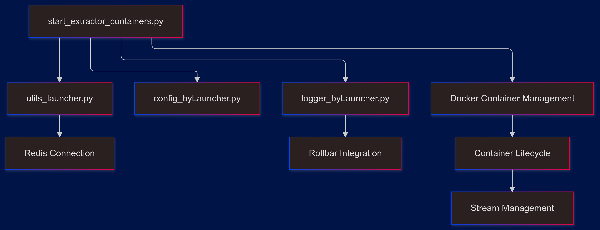

# Market Arbitrage ETL System

## System Overview
This repository contains technical documentation for a distributed bookie data extraction and processing system. The system is designed to collect, transform, and analyze bookie data from multiple sources in real-time.

## Key Capabilities
- Real-time data extraction from multiple bookie sources
- Distributed processing using Redis streams
- Containerized deployment architecture
- Scalable data transformation pipeline
- Automated data synchronization
- Real-time market analysis

## Documentation Structure

### Core Components
- **Data Extraction**: Integration with multiple data sources
- **Data Transformation**: Standardization and processing pipelines
- **Schema Management**: Redis-based data organization
- **System Orchestration**: Container and process management

### Architecture Diagrams
Located in `/embed/`, providing visual representations of:
- System flows
- Data transformations
- Component interactions
- Deployment architecture

### Technical Documentation
- Extraction processes
- Transformation pipelines
- Schema definitions
- Utility functions
- Container management

## System Architecture

## Documentation Only
**This repository contains only technical documentation and architectural diagrams. No source code is included.**

## Note
This is a documentation-only repository focused on system architecture and capabilities.(**FOR RESEARCH | EDUCATIONAL PURPOSES**)
 - Bookmaker names are obscured

## Key Documentation Sections

### 1. Data Integration Capabilities

- Real-time data extraction
- Multiple source support
- Error handling and retry mechanisms
- Rate limiting and request management

### 2. Data Processing Features

- Stream-based processing
- Data normalization
- Market analysis
- Cross-source validation

### 3. System Components

- Redis schema management
- Container orchestration
- Process monitoring
- Resource optimization

### 4. Architecture Patterns

- Distributed processing
- Event-driven architecture
- Data streaming
- Containerization

## Documentation Organization

### 1. Component Documentation

Each component's documentation includes:

- Architectural overview
- Process flows
- Integration points
- Key features

### 2. Flow Diagrams

Organized by component:

- Extraction flows
- Transformation sequences
- System interactions
- Deployment patterns

### 3. Integration Patterns

Documentation covers:

- Inter-component communication
- Data synchronization
- Error handling
- Resource management

## Diagram Categories

### 1. Flow Diagrams

- `*_flow*.png`: System and component flows
- `*_seqFlow.png`: Sequence diagrams
- `*_FD.png`: Functional diagrams
- `obs_* | *_obs`: obscured

### 2. Architecture Diagrams

- System architecture
- Component relationships
- Deployment patterns
- Integration flows

## Documentation Focus Areas

### 1. System Architecture

- Component relationships
- Data flows
- Integration patterns
- Scaling considerations

### 2. Data Processing

- Extraction mechanisms
- Transformation pipelines
- Data validation
- Market analysis

### 3. Deployment Architecture

- Container orchestration
- Resource management
- Process monitoring
- System scaling

## Usage Guidelines

### 1. Navigation

- Use diagram references for visual understanding
- Follow component documentation for detailed information
- Cross-reference integration patterns
- Review transformation flows

### 2. Documentation Reading

- Start with high-level architecture
- Review component interactions
- Understand data flows
- Examine specific implementations

### 3. Architecture Understanding

- Review system diagrams
- Follow data flow patterns
- Understand component relationships
- Study integration approaches

## Summary

This documentation repository provides:

- Comprehensive system architecture overview
- Detailed component documentation
- Visual process flows
- Integration patterns
- Deployment strategies
- Scaling considerations

The documentation illustrates the capabilities and architecture of a distributed bookie data system without exposing implementation details.