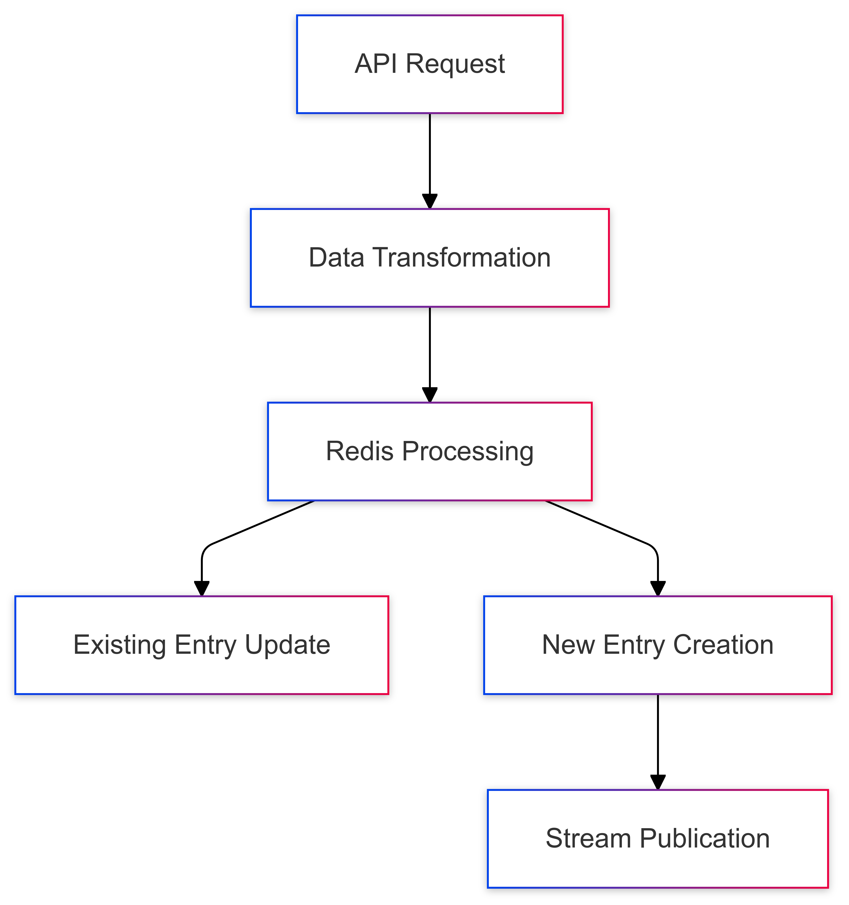
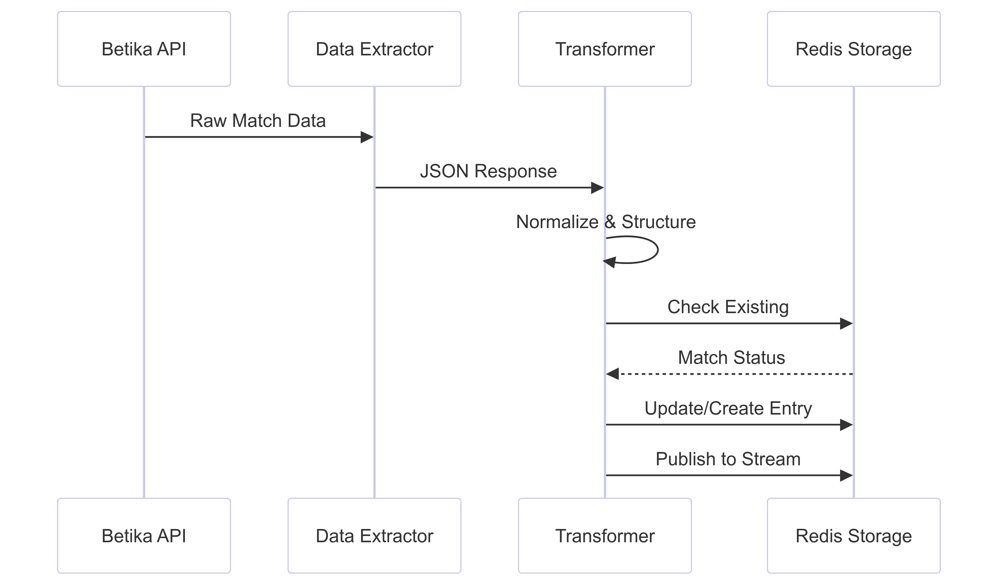

# Bookiealpha Data Extractor Docs

---
tags:
  - #obs_streamed_data 
  - #obs_extractors
---

## High-Level Overview

This codebase implements a data pipeline for collecting, processing, and storing sports betting data from Bookiealpha's API, focusing on soccer matches and their odds. The system handles three main types of bets:
- Three-Way (Win/Draw/Lose)
- Both Teams To Score (BTTS)
- Double Chance

## Core Architecture

### 1. Data Collection
- Uses `aiohttp` for asynchronous HTTP requests
- Implements retry logic with multiple proxy rotations
- Handles both live and upcoming matches
- Configurable date ranges for upcoming matches

### 2. Data Storage
- Uses Redis as the primary database
- Implements Redis JSON for structured data storage
- Uses Redis Streams for real-time data processing
- Maintains separate indices for different bet types

### 3. Data Processing Pipeline


## Key Features

### Command Line Usage
```bash
python -m extractors.BookieAlpha.three_way [data_source] [period]
python -m extractors.BookieAlpha.btts [data_source] [period]
python -m extractors.BookieAlpha.double_chance [data_source] [period]
```

### 1. Data Extraction
- Separate extractors for each bet type (three_way.py, btts.py, double_chance.py)
- Configurable parameters for:
  - Page size (limit)
  - Sport type (default: soccer)
  - Time period (live/upcoming)
  - Competition filtering

### 2. Data Transformation
The system transforms raw API data into a standardized format:
- Normalizes team names
- Standardizes odds formats
- Removes simulator/virtual games
- Adds metadata (timestamps, bookmaker info)

### 3. Redis Implementation

#### Index Structure
- Separate indices for each bet type and status (live/upcoming)
- Fields indexed include:
  - Bookmaker information
  - Match IDs
  - Start times
  - Competition names
  - Arbitrage opportunities

#### Data Storage Pattern
```
Key Pattern: matched_teams_{prefix}_{bet_type}_{status}_stream:
Example: matched_teams_xtr-BTTS_upcoming_stream:
```

## Process Flow

### 1. Initial Request
1. Makes API request to Bookiealpha
2. Uses rotating proxies for reliability
3. Implements exponential backoff for retries

### 2. Data Processing
1. Filters out non-soccer and virtual matches
2. Normalizes team names using Unicode normalization
3. Structures odds data into standardized format
4. Adds metadata and timestamps

### 3. Redis Operations
1. Checks for existing entries using match IDs
2. Updates existing entries with new odds
3. Creates new entries for new matches
4. Publishes updates to Redis streams
5. Maintains indices for efficient querying

### 4. Time Management
- Uses East African Time (EAT) for consistency
- Handles different time periods:
  - Live matches
  - Today's matches (period_id: -1)
  - Tomorrow's matches (period_id: 1)
  - Future matches (period_id: 2-4)

## Error Handling

1. Network Errors
- Implements retry logic
- Rotates through multiple proxies
- Uses exponential backoff

2. Data Validation
- Checks for required fields
- Validates data types
- Filters invalid entries

3. Redis Operations
- Handles connection errors
- Manages failed updates
- Implements fallback mechanisms

## Optimization Features

1. Performance
- Uses async/await for I/O operations
- Implements connection pooling
- Uses Redis pipelining where possible

2. Resource Management
- Implements stream trimming
- Manages cache expiration
- Controls data retention

3. Scalability
- Separates concerns by bet type
- Uses modular architecture
- Implements independent processors

## Configuration Management

1. Environment Variables
- Redis connection details
- Proxy configurations
- API endpoints

2. Runtime Parameters
- Batch sizes
- Retry attempts
- Timeout durations

## Summary of Data Flow



This system is designed to maintain real-time sports odds data while ensuring data consistency, reliability, and accessibility for downstream applications.