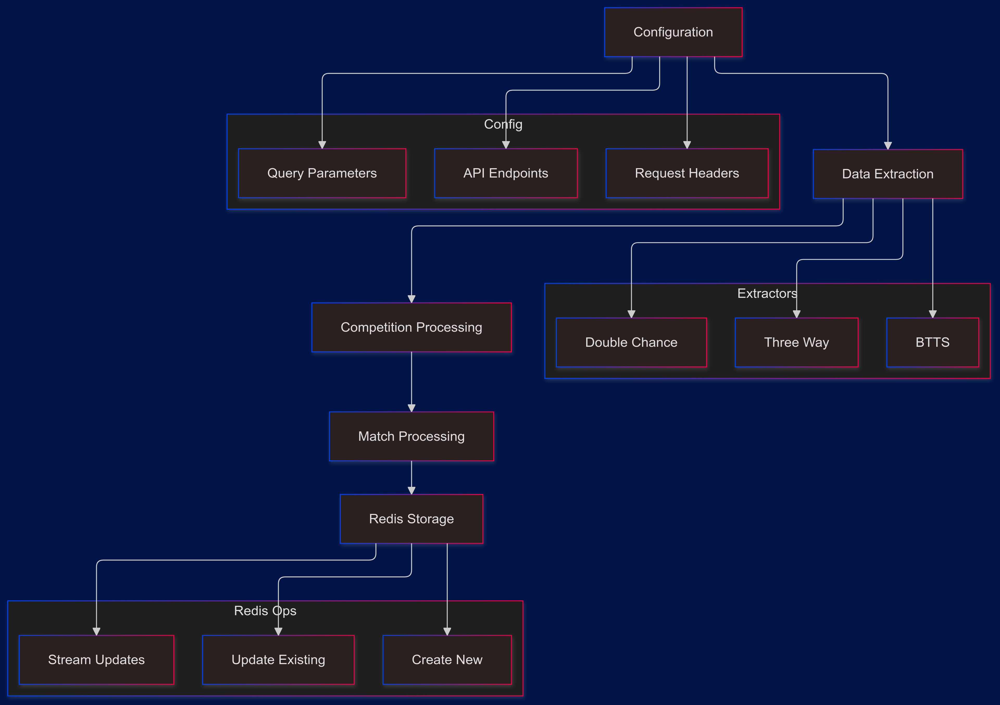

# Bookiebeta Data Extractors Analysis

---
tags:
  - #obs_streamed_data 
  - #obs_extractors
  - #obs_two-step_data_retrieval
---

## Core Architecture Overview



## Configuration Management

### Request Configuration Structure
```python
requests_config = {
    "upcoming": {
        "pregame": {
            "url": "https://api.logiqsport.com:60009/api/pregame/getPregameData",
            "querystring": {
                "providerId": "1",
                "h24": "false",
                "lang": "en",
                "siteid": "28",
            },
            "headers": {
                "User-Agent": "...",
                "Accept": "application/json",
                # ... other headers
            },
            "cache_expiry": 1200,
        },
        "games": {
            "url": "https://api.logiqsport.com:60009/api/Pregame/MarketsTreeEventsTable",
            # ... other configurations
        }
    }
}
```

### Key Configuration Features
1. Separate configurations for pregame and live data
2. Standardized request headers
3. Cache management settings
4. Provider and site-specific parameters

## Extractor Implementations

### Common Function Structure
```python
async def run_extractor(source_type, period):
    redis_conn = get_redis_connection()
    if not redis_conn:
        return
        
    # Configuration retrieval
    url = requests_config[source_type]["pregame"]["url"]
    headers = requests_config[source_type]["pregame"]["headers"]
    querystring = requests_config[source_type]["pregame"]["querystring"]
    
    # Cache management
    period_index = map_BookieBeta_period_to_index(period)
    cache_key = f"{os.getenv('PREFIX', 'xtr')}-BookieBeta_tournament_ids_{source_type}-{period_index}"
```

### Data Flow Process


## Tournament ID Management

### 1. Cache Operation
```python
async def get_payload(session, url, headers, querystring, period, parse_func):
    try:
        data = await make_request(session, url, headers=headers, **querystring)
        if data is not None:
            return parse_func(data, period)
    except Exception as e:
        logger.warning(f"Error getting payload for {period}: {e}")
    return None
```

### 2. Tournament Processing
```python
cached_tournament_ids = get_cached_tournament_ids(redis_conn, cache_key, logger)
if cached_tournament_ids:
    logger.info("using cached tourn ids")
    tournament_ids = cached_tournament_ids
else:
    # Fetch new tournament IDs
```

## Market Types Implementation

### 1. Three-Way Markets
```python
key = f"{os.getenv('PREFIX', 'xtr')}-THREE_WAY_{source_type}"
# Process match result markets
processed_data = parse_func(data, "Match Result")
```

### 2. BTTS Markets
```python
key = f"{os.getenv('PREFIX', 'xtr')}-BTTS_{source_type}"
# Process both teams to score markets
processed_data = parse_func(data, "Both Teams To Score")
```

### 3. Double Chance Markets
```python
key = f"{os.getenv('PREFIX', 'xtr')}-DOUBLE_CHANCE_{source_type}"
# Process double chance markets
processed_data = parse_func(data, "Double Chance")
```

## Concurrent Processing

### 1. Connection Pool Management
```python
pool_size = min(len(tournament_ids), 50)
connector = TCPConnector(limit=pool_size)
```

### 2. Task Execution
```python
async with ClientSession(connector=connector) as session:
    tasks = []
    for tourn_id in tournament_ids:
        task = process_post_payload(
            session,
            url_games,
            headers_games,
            key,
            tourn_id,
            querystring_games,
            parse_func,
            semaphore
        )
        tasks.append(task)
    results = await asyncio.gather(*tasks)
```

## Redis Operations

### 1. Existing Entry Updates
```python
if existing_entries:
    for d_key, match_id in existing_entries:
        item = next(item for item in filtered_data if item["match_id"] == match_id)
        redis_conn.json().merge(d_key, "$.match_team_objects.BookieBeta", item)
        redis_conn.json().merge(d_key, "$.arbitrage", 0)
```

### 2. New Entry Creation
```python
json_key = f"BookieBeta_{key}:{int(time.time())}-{period_index}"
redis_conn.json().set(json_key, Path.root_path(), filtered_data)
redis_conn.expire(json_key, 200)
```

### 3. Stream Publication
```python
stream_key = f"{key}_stream"
stream_id = redis_conn.xadd(stream_key, {"data_key": json_key})
```

## Error Handling

### 1. Request Errors
```python
try:
    data = await make_request(...)
except Exception as e:
    logger.warning(f"Error fetching competitions: {e}")
    return []
```

### 2. Processing Errors
```python
if isinstance(result, Exception):
    logger.warning(f"An error occurred {type(result).__name__}: {result}")
```

## Performance Optimizations

### 1. Connection Management
- Reusable connection pools
- Configurable pool sizes
- Semaphore-controlled concurrency

### 2. Cache Usage
- Tournament ID caching
- Configurable cache expiration
- Cache invalidation strategy

### 3. Batch Processing
- Concurrent task execution
- Efficient data filtering
- Bulk Redis operations

## Best Practices

### 1. Configuration Management
- Environment variable usage
- Consistent naming conventions
- Centralized configuration

### 2. Error Handling
- Comprehensive logging
- Graceful degradation
- Error propagation

### 3. Resource Management
- Connection pooling
- Memory efficiency
- Cache optimization

## Command Line Interface

```bash
# Three-Way Markets
python -m extractors.BookieBeta.three_way [data_source] [period]

# BTTS Markets
python -m extractors.BookieBeta.btts [data_source] [period]

# Double Chance Markets
python -m extractors.BookieBeta.double_chance [data_source] [period]
```

### Parameters
- data_source: 'live' or 'upcoming'
- period: '24H', '2D', '3D', '4D', '5D'

## Unique Bookiebeta Features

### 1. Period Mapping
```python
def map_BookieBeta_period_to_index(period):
    # Maps Bookiebeta-specific period formats to standard indices
    period_map = {
        "24H": 0,
        "2D": 1,
        "3D": 2,
        "4D": 3,
        "5D": 4
    }
    return period_map.get(period, 0)
```

### 2. API Structure
- Two-step data retrieval (competitions then matches)
- Pregame and live data separation
- Market-specific endpoints

### 3. Data Filtering
- Date-based filtering
- Market type filtering
- Competition-based filtering