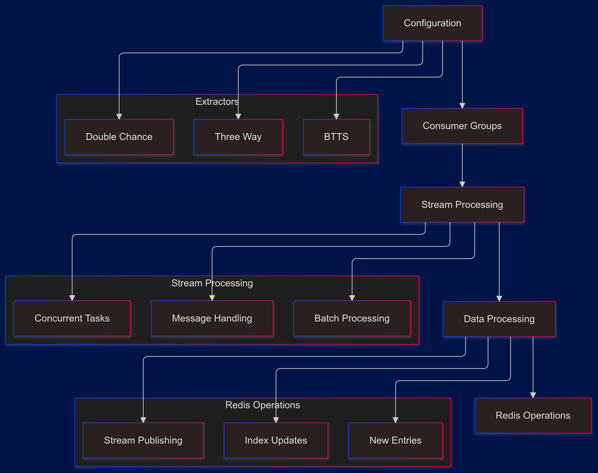

# BookieDelta Data Pipeline Analysis

---
tags:
  - #obs_streamed_data 
  - #obs_extractors
  - #obs_two-step_data_retrieval 
  - #obs_browser_client_listeners
---

## Core Architecture Overview



## Configuration Management

### API Configuration Structure
```python
config = {
    "live": {
        "url": "https://www.ke.bookiedelta.com/api/live/event/markets",
        "headers": {
            "Accept": "application/json",
            "User-Agent": "...",
            "X-App-Timezone": "Africa/Nairobi",
            # ... other headers
        }
    },
    "upcoming": {
        "url": "https://www.ke.bookiedelta.com/api/games/markets",
        # ... upcoming specific configs
    }
}
```

### Key Configuration Features
1. Environment-specific URLs (live/upcoming)
2. Standardized headers with timezone
3. Request configurations
4. Market-specific endpoints

## Stream Processing Implementation

### 1. Consumer Group Setup
```python
async def run_extractor(source_type, period=0, batch_size=int(os.getenv("BATCH"))):
    stream_key = f"bookiedelta_{BET_TYPE}-{source_type}-{period}_event"
    group_name = f"bookiedelta_{BET_TYPE}-{source_type}-{period}_consumer_group"
    consumer_name = f"bookiedelta_{BET_TYPE}-{source_type}-{period}_worker"
    
    create_consumer_group(redis_conn, stream_key, group_name)
```

### 2. Message Processing
```python
messages = redis_conn.xreadgroup(
    group_name, 
    consumer_name, 
    {stream_key: ">"}, 
    count=1, 
    block=1000
)
```

### 3. Batch Management
```python
if len(message_buffer) < batch_size:
    continue
pool_size = min(batch_size, 50)
semaphore = Semaphore(pool_size)
connector = TCPConnector(limit=pool_size)
```

## Market Type Processing

### 1. Three-Way Markets
```python
# Match Result processing
key = f"{os.getenv('PREFIX', 'lst')}-THREE_WAY_{source_type}"
async with ClientSession(connector=connector) as session:
    tasks = []
    for msg_id, key_path in message_buffer:
        task = process_payload(
            session, url, headers, key, params,
            group_json_data, process_outcome_data,
            semaphore
        )
```

### 2. BTTS Markets
```python
# Both Teams To Score processing
key = f"{os.getenv('PREFIX', 'lst')}-BTTS_{source_type}"
# Similar processing pattern with BTTS-specific transformations
```

### 3. Double Chance Markets
```python
# Double Chance processing
key = f"{os.getenv('PREFIX', 'lst')}-DOUBLE_CHANCE_{source_type}"
# Similar processing pattern with Double Chance specific transformations
```

## Data Processing Flow


## Redis Operations

### 1. Index Querying
```python
index_name = f"idx:{os.getenv('PREFIX', 'lst')}3way_{source_type}"
query = Query(
    f"@BookieDelta_eventID:[{eventId_gameId} {eventId_gameId}]"
).return_fields("__key")
result = redis_conn.ft(index_name).search(query)
```

### 2. Entry Updates
```python
if existing_entries:
    for d_key, eventId_gameId in existing_entries:
        item = next(
            item for item in all_data
            if item["eventId_gameId"] == eventId_gameId
        )
        redis_conn.json().merge(
            d_key, 
            "$.match_team_objects.BookieDelta", 
            item
        )
```

### 3. New Entry Creation
```python
json_key = f"sportPesa_{key}:{int(time.time())}-{period}"
redis_conn.json().set(json_key, Path.root_path(), new_data)
stream_key = f"{key}_stream"
stream_id = redis_conn.xadd(stream_key, {"data_key": json_key})
```

## Error Handling

### 1. Request Processing
```python
try:
    data = await make_request(session, url, headers=headers, **querystring)
    if data is not None:
        grouped_data = grouping_function(data)["grouped_data"]
        processed_data = parse_func(grouped_data)
        return key, processed_data
except Exception as e:
    logger.warning(f"Error processing payload: {e}")
```

### 2. Stream Processing
```python
try:
    messages = redis_conn.xreadgroup(...)
except RedisError as e:
    logger.warning(f"Redis error: {e}")
    await asyncio.sleep(5)
```

## Performance Optimizations

### 1. Connection Management
```python
pool_size = min(batch_size, 50)
connector = TCPConnector(limit=pool_size)
semaphore = Semaphore(pool_size)
```

### 2. Batch Processing
```python
tasks = []
for msg_id, key_path in message_buffer:
    task = asyncio.create_task(process_payload(...))
    tasks.append(task)
results = await asyncio.gather(*tasks, return_exceptions=True)
```

### 3. Resource Efficiency
- Connection pooling
- Semaphore-controlled concurrency
- Batch message processing

## Best Practices

### 1. Configuration Management
- Environment variables
- Centralized configuration
- Consistent naming

### 2. Error Handling
- Comprehensive logging
- Graceful degradation
- Exception handling

### 3. Resource Management
- Connection pooling
- Memory optimization
- Stream acknowledgment

## Unique SportPesa Features

### 1. Stream-Based Architecture
- Consumer groups
- Message buffering
- Batch processing

### 2. Data Grouping
- Market-specific grouping
- Event-based organization
- Structured updates

### 3. Index Management
- Specific index naming
- Query optimization
- Field mapping

## Command Line Usage

```bash
# Three-Way Markets
python -m extractors.BookieDelta.three_way [data_source] [period]

# BTTS Markets
python -m extractors.BookieDelta.btts [data_source] [period]

# Double Chance Markets
python -m extractors.BookieDelta.double_chance [data_source] [period]
```

### Parameters
- data_source: 'live' or 'upcoming'
- period: 0-4 for different time periods

## Comparison with Other Bookmakers

### Similarities
1. Market type handling
2. Redis storage structure
3. Basic data flow

### Key Differences
1. Stream-based processing
2. Consumer group implementation
3. Batch message handling