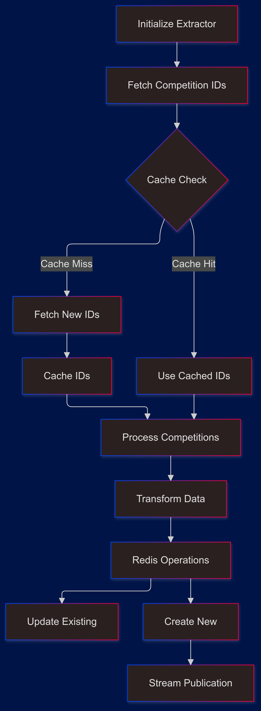
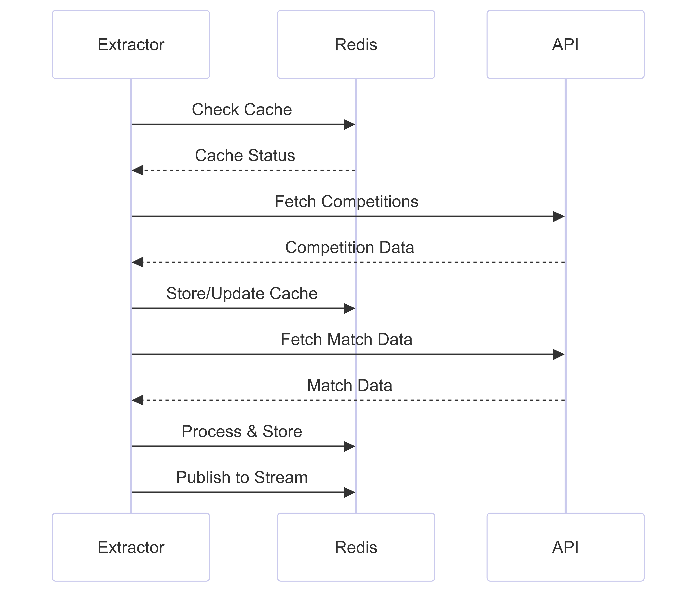

# Bookiegamma Data Extractors Analysis

---
tags:
  - #obs_streamed_data 
  - #obs_extractors
  - #obs_two-step_data_retrieval 
---

## Overview

The Bookiegamma extractors consist of three main modules for different bet types:
- Three-Way (Win/Draw/Loss)
- Both Teams To Score (BTTS)
- Double Chance

Each module implements a similar pattern but handles specific bet type data.

## Core Architecture

### Common Components


### Key Functions

#### 1. Competition ID Fetching
```python
async def fetch_competition_ids(session, url, headers, params):
    data = await make_request(session, url, headers=headers, **params)
    competitions = data["data"].get("competitions", [])
    competition_ids = [
        comp["competition_id"]
        for comp in competitions
        if "SRL" not in comp.get("competition_name", "")
    ]
    return competition_ids
```
- Retrieves available competition IDs
- Filters out simulator/virtual leagues (SRL)
- Uses async HTTP requests

#### 2. Match Processing
```python
async def fetch_and_process_matches(
    session, url, headers, competition_id, 
    base_params, parse_func, semaphore
):
    async with semaphore:
        results = []
        data = await make_request(
            session, url, headers=headers, **base_params
        )
        if data:
            processed_data = parse_func(data, bet_type)
            results.append(processed_data)
        return results
```
- Processes matches per competition
- Uses semaphore for concurrency control
- Applies bet-type specific parsing

## Implementation Details

### 1. Run Extractor Function
```python
async def run_extractor(source_type, period):
    # Configuration setup
    url = config["url"][source_type]
    headers_leagues = config["headers"][source_type]["header_leagues"]
    params_leagues = config["params"][source_type]["querystring_leagues"]
    
    # Redis connection
    redis_conn = get_redis_connection()
    
    # Process flow
    competition_ids = await fetch_competition_ids(...)
    results = await process_competitions(...)
    await store_results(...)
```

### Bet Type Specifics

#### Three-Way (1X2)
- Market Type: "1X2"
- Index Name: `idx:{prefix}3way_{source_type}`
- Stream Key: `{prefix}-THREE_WAY_{source_type}_stream`

#### BTTS
- Market Type: "GG/NG"
- Index Name: `idx:{prefix}btts_{source_type}`
- Stream Key: `{prefix}-BTTS_{source_type}_stream`

#### Double Chance
- Market Type: "Double chance"
- Index Name: `idx:{prefix}double_chance_{source_type}`
- Stream Key: `{prefix}-DOUBLE_CHANCE_{source_type}_stream`

## Data Flow Process

### 1. Initial Setup
```python
current_day = get_the_day(period)
PREFIX = os.getenv("PREFIX", "lst")
key = f"{PREFIX}-{BET_TYPE}_{source_type}"
cache_key = f"{PREFIX}-odi_competition_ids_{source_type}-{period}"
```

### 2. Competition Processing


### 3. Redis Operations

#### Existing Entry Updates
```python
redis_conn.json().merge(
    d_key, 
    "$.match_team_objects.BookieGamma", 
    item
)
redis_conn.json().merge(
    d_key, 
    "$.arbitrage", 
    0
)
```

#### New Entry Creation
```python
json_key = f"BookieGamma_{key}:{int(time.time())}-{period}"
redis_conn.json().set(
    json_key, 
    Path.root_path(), 
    new_data
)
redis_conn.expire(json_key, 200)
```

## Performance Optimizations

### 1. Connection Pooling
```python
pool_size = min(len(competition_ids), 50)
connector = TCPConnector(limit=pool_size)
```

### 2. Concurrent Processing
```python
semaphore = Semaphore(pool_size)
async with ClientSession(connector=connector) as session:
    tasks = [
        asyncio.create_task(
            fetch_and_process_matches(...)
        )
        for competition_id in competition_ids
    ]
    results = await asyncio.gather(*tasks, return_exceptions=True)
```

### 3. Cache Management
- Competition IDs caching
- Configurable cache expiry
- Separate caches for different periods

## Error Handling

### 1. Competition Fetching
```python
try:
    data = await make_request(...)
except Exception as e:
    logger.warning(f"Error fetching competitions: {e}")
    return []
```

### 2. Match Processing
```python
try:
    processed_data = parse_func(data, bet_type)
except Exception as e:
    logger.warning(
        f"Error processing matches for competition {competition_id}: {e}"
    )
    return e
```

## Usage Instructions

### Command Line Usage
```bash
python -m extractors.BookieGamma.three_way [data_source] [period]
python -m extractors.BookieGamma.btts [data_source] [period]
python -m extractors.BookieGamma.double_chance [data_source] [period]
```

### Parameters
- data_source: 'live' or 'upcoming'
- period: 0 (today) to 4 (future dates)

## Best Practices Implemented

1. **Resource Management**
   - Connection pooling
   - Semaphore-controlled concurrency
   - Cache utilization

2. **Error Handling**
   - Comprehensive logging
   - Graceful failure handling
   - Exception propagation

3. **Performance**
   - Async/await patterns
   - Batch processing
   - Connection reuse

4. **Data Integrity**
   - Validation checks
   - Atomic updates
   - Transaction safety