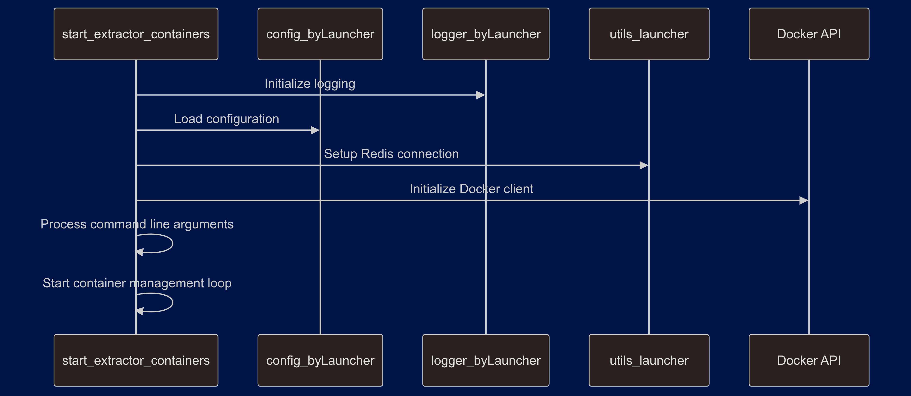
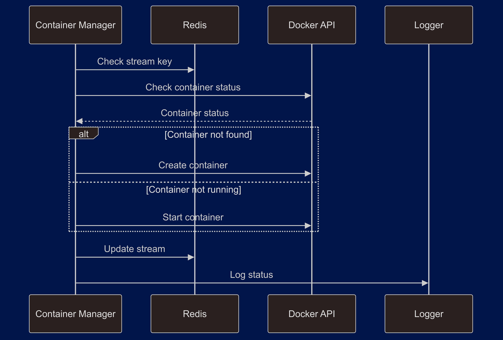

# Betting Data Extraction Launcher System Analysis


---
tags:
  - #obs_xtr_container
---

## System Architecture Overview


## Core Components

### 1. Configuration Management (config_byLauncher.py)

```python
config = {
    "extract": {
        "live": {
            "stream": "XTR-BTTS_live_stream",
            "BookieGamma": {"date": [0]},
            "BookieAlpha": {"date": [-1]},
        },
        "upcoming": {
            "btts_stream": "XTR-BTTS_upcoming_stream",
            "three_way_stream": "XTR-THREE_WAY_upcoming_stream",
            "double_chance_stream": "XTR-DOUBLE_CHANCE_upcoming_stream",
            "BookieBeta": {
                "date": ["24H", "2D", "3D", "4D", "5D"],
            },
            "BookieGamma": {
                "date": [0, 1, 2, 3, 4],
            },
            "BookieAlpha": {
                "date": [-1, 1, 2, 3, 4],
            },
        },
    }
}
```

Key features:
- Hierarchical configuration structure
- Bookmaker-specific date mappings
- Stream key definitions
- Market type organization

### 2. Logging System (logger_byLauncher.py)

#### Core Logger Implementation
```python
class Logger:
    def __init__(self, name):
        self.logger = logging.getLogger(name)
        self.setup_logging()

    def setup_logging(self):
        if not os.path.exists(LOG_DIR):
            os.makedirs(LOG_DIR)
        
        log_file = os.path.join(
            LOG_DIR, 
            f"{self.logger.name}_{now.strftime('%Y-%m-%d')}.log"
        )
        file_handler = RotatingFileHandler(
            log_file, 
            maxBytes=MAX_LOG_SIZE, 
            backupCount=BACKUP_COUNT
        )
```

Features:
- Rotating file handlers
- Size-based rotation
- Date-based log files
- Rollbar integration
- Log level management
- Error tracking

### 3. Utility Functions (utils_launcher.py)

#### Redis Connection Management
```python
def get_redis_connection():
    host = os.getenv("REDIS_HOST")
    port = int(os.getenv("REDIS_PORT"))
    db = int(os.getenv("REDIS_DB"))
    password = os.getenv("REDIS_PASS", None)
    try:
        r_db = redis.Redis(
            host=host, 
            port=port, 
            db=db, 
            password=password, 
            decode_responses=True
        )
        r_db.ping()
        return r_db
    except Exception as e:
        print(f"Failed to connect to Redis: {e}")
        return None
```

Key utilities:
- Redis connection handling
- Stop file checking
- Date normalization
- Environment loading

### 4. Container Management (start_extractor_containers.py)

#### Container Lifecycle Management
```python
def manage_docker_containers(
    client, 
    image_name, 
    container_name, 
    **container_options
):
    try:
        container = client.containers.get(container_name)
        if container.status != "running":
            container.start()
    except docker.errors.NotFound:
        container = client.containers.run(
            image_name,
            detach=True,
            name=container_name,
            network="x-net",
            **container_options
        )
    return container
```

Features:
- Container creation/management
- Network configuration
- Environment injection
- Status monitoring

## Process Flows

### 1. Launcher Initialization



### 2. Container Management Flow



## Key Features

### 1. Container Orchestration

#### Stream Key Management
```python
def get_stream_key(data_source, extractor_type, day):
    try:
        if data_source == "live":
            stream_key = config["extract"][data_source]["stream"]
        else:
            stream_key = config["extract"][data_source][f"{extractor_type}_stream"]
        return f"{stream_key}-{day}"
    except KeyError as e:
        logger.warning(f"Configuration error: {str(e)}")
        raise
```

#### Container Options Management
```python
container_options = {
    "environment": [
        "STREAM=" + stream_key,
        "PREFIX=" + prefix,
        "XTRTYPE=" + container_name,
        "XTR_BATCH=" + x,
    ]
}
```

### 2. Error Handling

#### Comprehensive Error Management
```python
def stop_containers(docker_client, containers):
    for container_id, container_name in containers.items():
        try:
            container = docker_client.containers.get(container_id)
            container.stop()
            logger.info(f"Stopped container: {container_name}")
        except docker.errors.NotFound:
            logger.warning(
                f"Container {container_name} not found."
            )
        except Exception as e:
            logger.warning(
                f"Error stopping container: {e}"
            )
```

### 3. Logging Architecture

#### Log Rotation and Cleanup
```python
@staticmethod
def clear_old_logs():
    current_time = datetime.now()
    for filename in os.listdir(LOG_DIR):
        file_path = os.path.join(LOG_DIR, filename)
        file_modified = datetime.fromtimestamp(
            os.path.getmtime(file_path)
        )
        if current_time - file_modified > timedelta(
            hours=MAX_LOG_AGE_HOURS
        ):
            os.remove(file_path)
```

## Integration Points

### 1. Redis Integration
- Stream management
- Data persistence
- Container coordination
- Message processing

### 2. Docker Integration
- Container lifecycle management
- Network configuration
- Resource allocation
- Status monitoring

### 3. Logging Integration
- Rollbar error tracking
- File-based logging
- Log rotation
- Error notification

## Best Practices

### 1. Configuration Management
- Centralized configuration
- Environment variables
- Secure credentials
- Flexible deployment

### 2. Error Handling
- Comprehensive logging
- Graceful degradation
- Error recovery
- Status monitoring

### 3. Resource Management
- Container cleanup
- Log rotation
- Memory optimization
- Connection pooling

## Deployment Instructions

### 1. Environment Setup
```bash
# Set required environment variables
export REDIS_HOST=localhost
export LOG_DIR=log_dir
export ROLLBAR_ACCESS_TOKEN=your_token
export ROLL_ENVIRONMENT=production
```

### 2. Launching the System
```bash
# Start the launcher
python start_extractor_containers.py <xtr> <data_source>

# Monitor logs
tail -f /var/log/extractors/launcher_*.log
```

### 3. Container Management
```bash
# Check container status
docker ps | grep extractors

# View container logs
docker logs <container_name>
```

## Production Considerations

### 1. Scaling
- Multiple container instances
- Load balancing
- Resource allocation
- Performance monitoring

### 2. Monitoring
- Log aggregation
- Metrics collection
- Alert configuration
- Status dashboards

### 3. Security
- Network isolation
- Access control
- Secure configurations
- Audit logging

## Summary

The launcher system provides a robust framework for managing betting data extraction containers, featuring:
- Comprehensive configuration management
- Sophisticated logging system
- Reliable container orchestration
- Error handling and recovery
- Production-ready deployment
- Monitoring and maintenance

The implementation ensures reliable operation while maintaining security, performance, and maintainability standards.