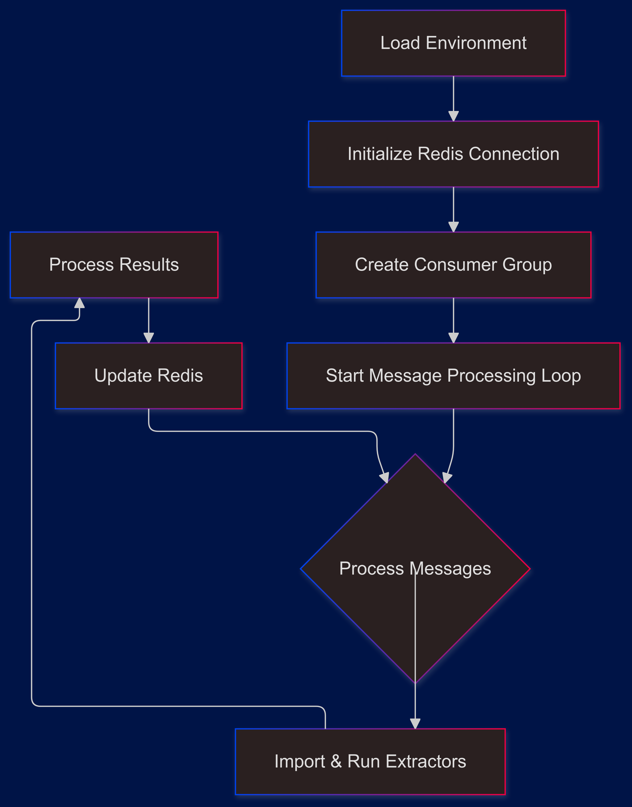

# Core Extractor Entrypoint Analysis

---

tags:

- #obs_entrypoint
- #obs_streamed_data
- #obs_xtr_container

---

links:

- ,,,
  ,

## Overview

serves as the critical entrypoint for the bookies_mispriced data extraction system, orchestrating the concurrent processing of bookies_mispriced data from multiple bookmakers (Bookiealpha, Bookiegamma, Bookiebeta, Bookiedelta). It implements a Redis Stream-based architecture for reliable message processing and data synchronization.

## Core Architecture

### High-Level Flow



## Key Components

### 1. Dynamic Extractor Loading

```python
async def import_and_run_extractor(bookmaker, extractor_type, data_source, stream_date):
    module = import_module(f"extractors.{bookmaker}.{extractor_type}")
    result = await module.run_extractor(data_source, period)
    return result
```

Key features:

- Dynamic module imports based on bookmaker and extractor type
- Asynchronous execution
- Period/date handling specific to each bookmaker
- Comprehensive error handling for import and execution

### 2. Message Processing Loop

```python
async def listen_for_messages(redis_db, group_name, consumer_name, stream_name):
    message_buffer = []
    bookmaker_results = defaultdict(list)
```

Critical aspects:

- Message buffering for batch processing
- Concurrent extractor execution
- Result aggregation by bookmaker
- Stream acknowledgment handling
- Entry matching across bookmakers

## Data Flow

### 1. Message Structure

```json
{
  "bookmaker": "BookieAlpha|BookieGamma|BookieBeta|bookiedelta",
  "extractor_type": "btts|three_way|double_chance",
  "data_source": "live|upcoming",
  "stream_date": "period identifier"
}
```

### 2. Processing Pipeline

1. Message Reception → Buffer accumulation
2. Batch Processing → Concurrent extractor execution
3. Result Aggregation → Bookmaker-wise collection
4. Entry Matching → Cross-bookmaker validation
5. Redis Updates → Data persistence and stream publishing

## Key Features

### 1. Batch Processing

- Configurable batch sizes via environment variables
- Message buffering until batch size reached
- Concurrent processing of batched messages

### 2. Cross-Bookmaker Entry Matching

```python
entry_counts = defaultdict(int)
for bookmaker_entries in bookmaker_results.values():
    for entry in bookmaker_entries:
        entry_counts[entry] += 1

min_count = 2 if extractor_type == "btts" else int(batch_size)
matching_entries = {
    entry for entry, count in entry_counts.items()
    if count >= min_count
}
```

Features:

- Dynamic minimum match threshold based on extractor type
- Entry counting across bookmakers
- Flexible matching criteria

### 3. Redis Integration

#### Stream Operations

- Consumer group management
- Message acknowledgment
- Stream trimming
- JSON entry updates

#### Data Updates

```python
redis_db.json().merge(entry, "$.bookie_updated", get_current_date())
matched_stream_key = f"{data_source}_{extractor_type}-matched_stream"
stream_id = redis_db.xadd(matched_stream_key, {"data_key": entry})
```

## Error Handling

### 1. Extractor Execution

```python
try:
    result = await import_and_run_extractor(
        bookmaker, extractor_type, data_source, stream_date
    )
except ImportError:
    logger.info("Failed to import module")
except AttributeError:
    logger.info("Module does not have run_extractor function")
except Exception as e:
    logger.info(f"An error occurred: {e}")
```

### 2. Message Processing

- Connection error handling
- Message parsing errors
- Result processing failures
- Redis operation failures

## Configuration Management

### 1. Environment Variables

- `STREAM`: Redis stream identifier
- `XTRTYPE`: Extractor type identifier
- `XTR_BATCH`: Batch processing size

### 2. Redis Configuration

- Consumer group setup
- Stream configuration
- Connection parameters

## Performance Considerations

### 1. Message Buffering

- Optimal batch sizes
- Memory efficient buffering
- Result aggregation strategy

### 2. Concurrent Processing

- Extractor parallelization
- Resource utilization
- Redis connection management

### 3. Stream Management

- Regular stream trimming
- Efficient acknowledgment
- Memory optimization

## Integration with Bookmaker Extractors

### 1. ~~Bookiealpha~~ Integration

- Period mapping: -1 to 4
- Market type handling
- Result processing

### 2. ~~Bookiegamma~~ Integration

- Period mapping: 0 to 4
- Market synchronization
- Data transformation

### 3. ~~Bookiebeta~~ Integration

- Period format: "24H" to "5D"
- Tournament ID handling
- Result processing

### 4. ~~Bookiedelta~~ Integration

- Event ID management
- Market correlation
- Result aggregation

## Best Practices

### 1. Error Handling

- Comprehensive logging
- Graceful degradation
- Error propagation

### 2. Resource Management

- Connection pooling
- Memory optimization
- Batch processing

### 3. Code Organization

- Modular design
- Clear responsibilities
- Maintainable structure

## Usage Examples

### 1. Starting the Processor

```bash
# Environment setup
export STREAM="XTR-BTTS_live_stream"
export XTRTYPE="btts-worker"
export XTR_BATCH="3"

# Run the processor
python Main.py
```

### 2. Monitoring Operation

- Check Redis streams
- Monitor consumer group status
- Track matched entries

## Summary

finally, the entrypoint serves as a crucial orchestrator in the bookies_mispriced data extraction system, managing:

- Dynamic extractor loading and execution
- Message processing and buffering
- Cross-bookmaker entry matching
- Redis stream operations
- Error handling and recovery

Its design ensures reliable, scalable, and efficient processing of bookies_mispriced data across multiple bookmakers while maintaining data consistency and system reliability.
