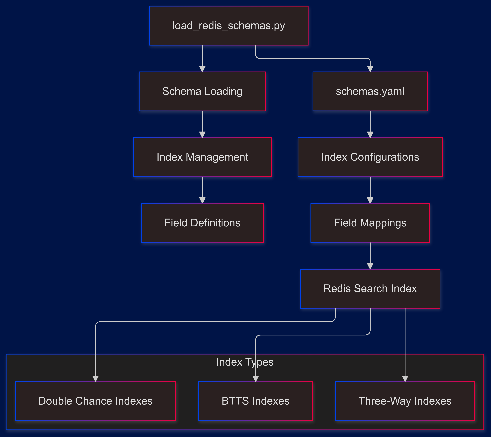

# Redis Schema Management System Analysis

## System Architecture Overview



## Schema Structure Analysis

### 1. Core Index Categories

```yaml
# High-level index organization
indexes:
  - name: idx:xtrbtts_upcoming
    prefix: ["matched_teams_xtr-BTTS_upcoming_stream:"]
  - name: idx:xtr3way_upcoming
    prefix: ["matched_teams_xtr-THREE_WAY_upcoming_stream:"]
  - name: idx:xtrdouble_chance_upcoming
    prefix: ["matched_teams_xtr-DOUBLE_CHANCE_upcoming_stream:"]
```

#### Index Types:
1. Live Betting Indexes
   - BTTS live
   - Three-way live
   - Double chance live
2. Upcoming Match Indexes
   - BTTS upcoming
   - Three-way upcoming
   - Double chance upcoming

### 2. Field Type Definitions

```yaml
fields:
  - name: bookmaker
    path: $.match_team_objects..bookmaker
    type: tag
  - name: arbitrage
    path: $.arbitrage
    type: numeric
  - name: match_date
    path: $.match_date
    type: text
```

#### Field Categories:

1. **Tag Fields**
   - Bookmaker identifiers
   - Start times
   - Competition names
   - Status indicators

2. **Numeric Fields**
   - Match IDs
   - Arbitrage values
   - Timestamps
   - Update markers

3. **Text Fields**
   - Match dates
   - Additional metadata
   - Search content

## Schema Loading Implementation

### 1. Configuration Loading

```python
def load_schemas_from_yaml(yaml_file):
    with open(yaml_file, "r") as file:
        config = yaml.load(file, Loader=yaml.FullLoader)["indexes"]
```

### 2. Field Creation System

```python
def create_field(field_config):
    field_type = field_config["type"]
    field_name = field_config["name"]
    field_path = field_config["path"]
    
    if field_type == "text":
        return TextField(
            field_path,
            as_name=field_name,
            sortable=field_config.get("sortable", False)
        )
    elif field_type == "tag":
        return TagField(
            field_path,
            as_name=field_name,
            sortable=field_config.get("sortable", True)
        )
    elif field_type == "numeric":
        return NumericField(
            field_path,
            as_name=field_name,
            sortable=field_config.get("sortable", True)
        )
```

## Index Structure Analysis

### 1. Bookmaker-Specific Fields

```yaml
# Per-bookmaker field structure
BookieAlpha_fields:
  - name: BookieAlpha_id
    path: $.match_team_objects.BookieAlpha.parent_match_id
    type: numeric
  - name: BookieAlpha_start_time
    path: $.match_team_objects.BookieAlpha.start_time
    type: tag
```

### 2. Common Fields Structure

```yaml
common_fields:
  - name: arbitrage
    path: $.arbitrage
    type: numeric
  - name: created
    path: $.created
    type: numeric
  - name: bookie_updated
    path: $.bookie_updated
    type: numeric
```

## Index Management System

### 1. Index Creation Process

```python
def create_index(redis_conn, index_name, schema, prefix):
    try:
        # Drop existing index if present
        redis_conn.ft(index_name).dropindex()
    except ResponseError:
        pass
        
    # Create new index
    definition = IndexDefinition(
        prefix=prefix,
        index_type=IndexType.JSON
    )
    
    redis_conn.ft(index_name).create_index(
        schema,
        definition=definition
    )
```

### 2. Index Update Management

```python
def update_index(redis_conn, index_name, schema, prefix):
    try:
        # Check if index exists
        redis_conn.ft(index_name).info()
        # Drop and recreate if exists
        redis_conn.ft(index_name).dropindex()
    except ResponseError:
        pass
    
    # Create new index
    create_index(redis_conn, index_name, schema, prefix)
```

## Querying Capabilities

### 1. Query Structure Examples

```python
# Arbitrage opportunity search
@arbitrage:[-inf 0] @bookmaker:{BookieAlpha}

# Time-based queries
@BookieAlpha_start_time:[1698710400 1698796800]

# Competition filtering
@BookieAlpha_competition_name:{premier_league}

# BASH {redis-cli FT.*}
# range query dates_______________year + month_____________or just month

FT.SEARCH idx:xtrbtts_upcoming '@match_date:2024 @match_date:10' RETURN 3 $.match_team_objects $.teams $.match_date LIMIT 0 100


FT.SEARCH idx:xtrbtts_upcoming '@match_date:2024*09' RETURN 3 $.match_team_objects $.teams $.match_date LIMIT 0 1

FT.SEARCH idx:xtrbtts_upcoming '@match_date:*01*' RETURN 4 $.match_team_objects BookieGamma_id BookieAlpha_id $.match_date LIMIT 0 1

# by day

FT.SEARCH idx:xtrbtts_upcoming '@match_date:*29' RETURN 3 $.match_team_objects $.teams $.match_date LIMIT 0 1

FT.SEARCH idx:lst3way_upcoming "@arb_updated:[0.000001 +inf]" RETURN 3 BookieDelta_eventID BookieAlpha_id BookieGamma_id LIMIT 0 1
```

### 2. Index Usage Patterns

```python
# Match lookup by ID
ft.search idx:xtrbtts_upcoming "@BookieAlpha_id:[123 123]"

# Multi-bookmaker match
ft.search idx:xtr3way_upcoming "@bookmaker:{BookieAlpha|BookieGamma}"

# Arbitrage opportunities
ft.search idx:xtrdouble_chance_upcoming "@arbitrage:[1 +inf]"
```

## Performance Optimization

### 1. Index Optimization

```yaml
# Optimized field configuration
fields:
  - name: match_id
    path: $.id
    type: numeric
    sortable: true
    noindex: false
```

### 2. Memory Management

```python
# Index cleanup routine
def cleanup_indexes(redis_conn):
    for index in get_indexes(redis_conn):
        try:
            info = redis_conn.ft(index).info()
            if info['num_docs'] == 0:
                redis_conn.ft(index).dropindex()
        except ResponseError:
            continue
```

## Error Handling

### 1. Schema Loading Errors

```python
def safe_load_schema(yaml_file):
    try:
        with open(yaml_file, "r") as file:
            return yaml.load(file, Loader=yaml.FullLoader)
    except yaml.YAMLError as e:
        print(f"Error parsing YAML: {e}")
        return None
    except FileNotFoundError:
        print(f"Schema file not found: {yaml_file}")
        return None
```

### 2. Index Creation Errors

```python
def safe_create_index(redis_conn, index_name, schema, prefix):
    try:
        create_index(redis_conn, index_name, schema, prefix)
    except Exception as e:
        print(f"Error creating index {index_name}: {e}")
        return False
    return True
```

## Best Practices

### 1. Schema Organization
- Logical field grouping
- Consistent naming conventions
- Clear documentation
- Version control

### 2. Index Management
- Regular maintenance
- Performance monitoring
- Cleanup routines
- Version tracking

### 3. Error Handling
- Comprehensive validation
- Graceful degradation
- Error logging
- Recovery procedures

## Deployment Guidelines

### 1. Schema Updates
```bash
# Load/update schemas
python load_redis_schemas.py

# Verify indexes
redis-cli FT._LIST
```

### 2. Index Maintenance
```bash
# Check index info
redis-cli FT.INFO idx:xtrbtts_upcoming

# Monitor memory usage
redis-cli INFO memory
```

## Production Considerations

### 1. Performance
- Index size monitoring
- Query optimization
- Memory management
- Scaling considerations

### 2. Maintenance
- Regular cleanup
- Index optimization
- Performance tuning
- Error monitoring

### 3. Backup
- Schema backups
- Index snapshots
- Recovery procedures
- Version control

## Summary

The Redis schema management system provides:
- Comprehensive index management
- Flexible field definitions
- Efficient querying capabilities
- Robust error handling
- Production-ready deployment
- Maintenance utilities

The implementation ensures reliable data storage and retrieval while maintaining performance and maintainability standards.