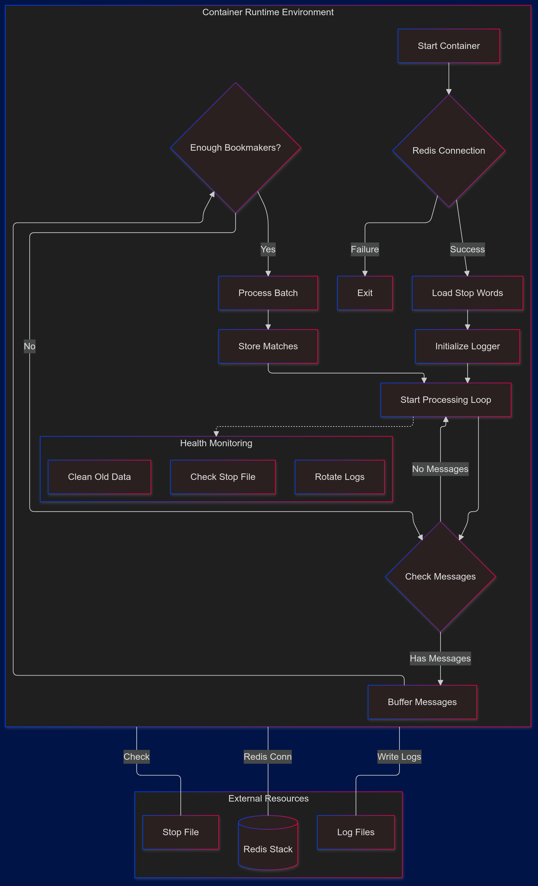
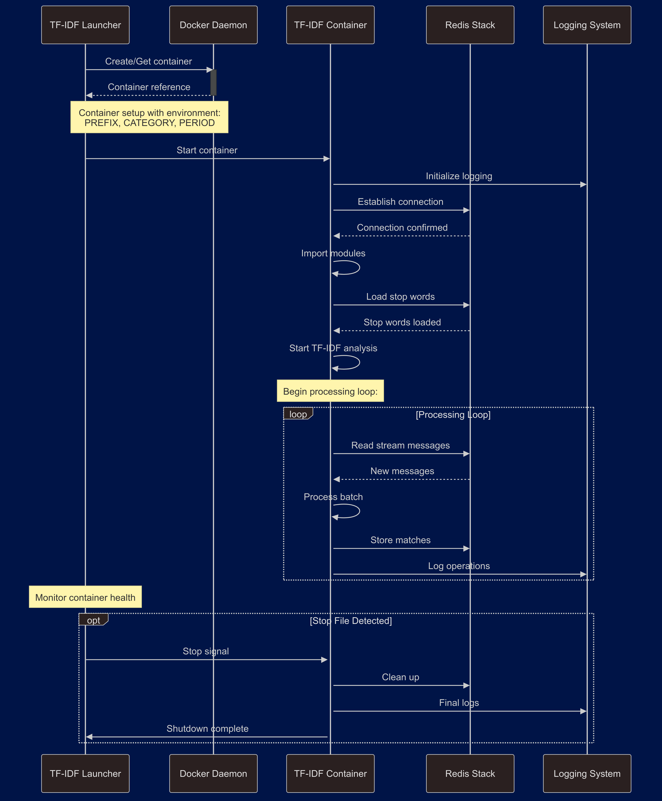

# TF-IDF Match Processing System - Launcher Documentation

---
linked:
  - 
---

## System Overview

The TF-IDF Match Processing System launcher coordinates containerized matching operations across multiple bookmaker data streams. It manages parallel processing containers for different bet types (BTTS, Three-Way, Double Chance) while ensuring proper resource allocation and error handling.



## Core Components

### 1. Container Launcher (`start_tfidf_containers.py`)

#### 1.1 Main Configuration
```python
# Required command-line parameters
prefix = sys.argv[1]        # 'lst' or 'xtr'
data_source = sys.argv[2]   # 'live' or 'upcoming'

# Processing types
extractor_types = ["btts", "three_way", "double_chance"]
```

#### 1.2 Container Management
```python
def manage_docker_containers(
    client: docker.DockerClient, 
    image_name,
    container_name,
    **container_options
):
    """
    Manages individual container lifecycle.
    
    Args:
        client: Docker client instance
        image_name: Container image to use
        container_name: Unique container identifier
        container_options: Additional container configuration
    
    Returns:
        docker.Container: Running container instance
    """
```

Key Features:
- Automatic container creation/restart
- Network isolation ("chrome-net")
- Environment variable injection
- Status monitoring

### 2. Utility Functions (`utils_launcher.py`)

```python
def check_stop_file():
    """
    Checks for presence of stop signal file.
    
    Returns:
        bool: True if stop file exists
    """
    return os.path.exists("/home/matata-7920/stop_launchers.txt")
```

Purpose:
- Enables graceful shutdown
- Centralized stop mechanism
- File-based signaling

### 3. Logging System (`logger_byLauncher.py`)

#### 3.1 Logger Configuration
```python
LOG_DIR = os.getenv("LOG_DIR")
MAX_LOG_SIZE = 1 * 1024 * 1024  # 1 MB
BACKUP_COUNT = 5
MAX_LOG_AGE_HOURS = 2
```

#### 3.2 Core Logger Class
```python
class Logger:
    def __init__(self, name):
        self.logger = logging.getLogger(name)
        self.setup_logging()
```

Features:
- Rotating file handlers
- Size-based rotation
- Age-based cleanup
- Rollbar integration

## Process Flow

### 1. Initialization
1. Command-line argument validation
2. Docker client initialization
3. Logger setup
4. Container list initialization

### 2. Main Processing Loop
```python
while True:
    try:
        # Check for stop signal
        if check_stop_file():
            logger.info("Stop file detected. Stopping containers...")
            stop_containers(docker_client, active_containers)
            sys.exit(0)

        # Process each extractor type
        for extractor_type in extractor_types:
            container_name = f"{prefix}tfidf_{extractor_type}_{data_source}"
```

### 3. Container Lifecycle Management
1. Container existence check
2. Status verification
3. Start/restart as needed
4. Environment setup

## Error Handling

### 1. Container Level
```python
try:
    container = client.containers.get(container_name)
    if container.status != "running":
        container.start()
except docker.errors.NotFound:
    container = client.containers.run(...)
```

### 2. System Level
```python
except Exception as e:
    exc_type, exc_value, exc_traceback = sys.exc_info()
    error_details = traceback.extract_tb(exc_traceback)
    
    error_message = f"An error occurred: {str(e)}\n"
    error_message += "Traceback (most recent call last):\n"
```

## Logging Implementation

### 1. File Management
```python
log_file = os.path.join(
    LOG_DIR, 
    f"{self.logger.name}_{now.strftime('%Y-%m-%d')}.log"
)
file_handler = RotatingFileHandler(
    log_file, 
    maxBytes=MAX_LOG_SIZE, 
    backupCount=BACKUP_COUNT
)
```

### 2. Log Rotation
```python
@staticmethod
def clear_old_logs():
    current_time = datetime.now()
    for filename in os.listdir(LOG_DIR):
        file_path = os.path.join(LOG_DIR, filename)
        file_modified = datetime.fromtimestamp(
            os.path.getmtime(file_path)
        )
```

### 3. Log Levels
- DEBUG: Detailed debugging information
- INFO: General operational information
- WARNING: Warning messages
- ERROR: Error conditions
- CRITICAL: Critical conditions

## Best Practices

### 1. Container Management
- Regular status checks
- Graceful shutdown support
- Resource cleanup
- Error recovery

### 2. Logging
- Systematic rotation
- Size management
- Age-based cleanup
- Error tracking

### 3. Error Handling
- Comprehensive catching
- Detailed logging
- Recovery procedures
- System stability

## Usageq

### Command Line
```bash
python match_launcher/start_tfidf_containers.py <lst|xtr> <live|upcoming>
```

### Parameters
- First argument: System prefix ('lst' or 'xtr')
- Second argument: Data source ('live' or 'upcoming')

### Example
```bash
python match_launcher/start_tfidf_containers.py xtr live
```

## Monitoring

### 1. Log Files
```bash
tail -f /var/log/analyzeMatch/launcher_*.log
```

### 2. Container Status
```bash
docker ps | grep tfidf
```

## Production Considerations

### 1. Scaling
- Multiple container instances
- Resource allocation
- Load distribution
- Performance monitoring

### 2. Maintenance
- Log rotation
- Container cleanup
- Error monitoring
- System updates

### 3. Security
- Network isolation
- Resource limits
- Access control
- Secure configurations

## Summary of Data Flow

