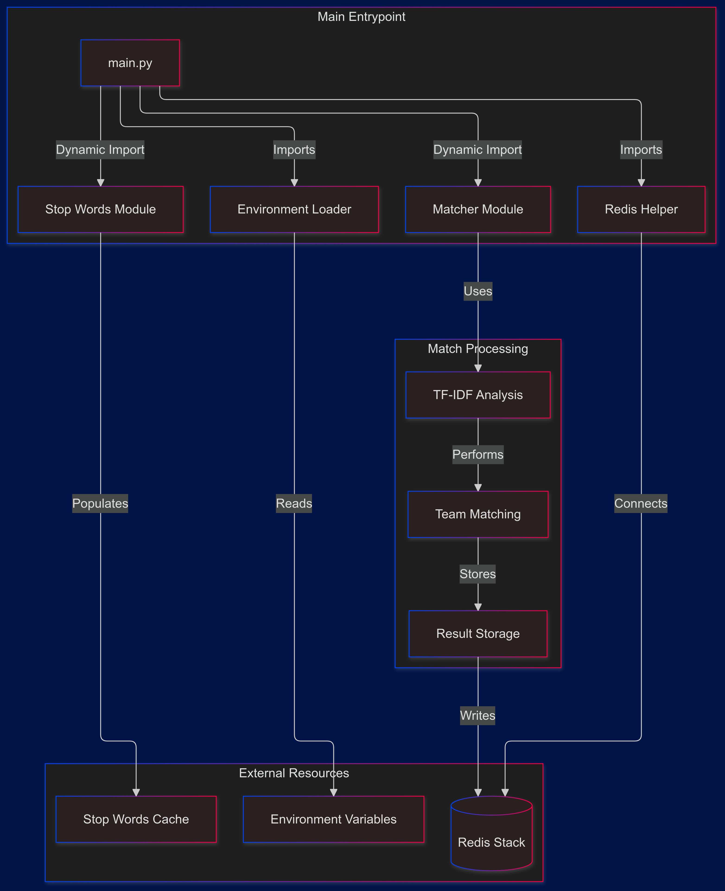
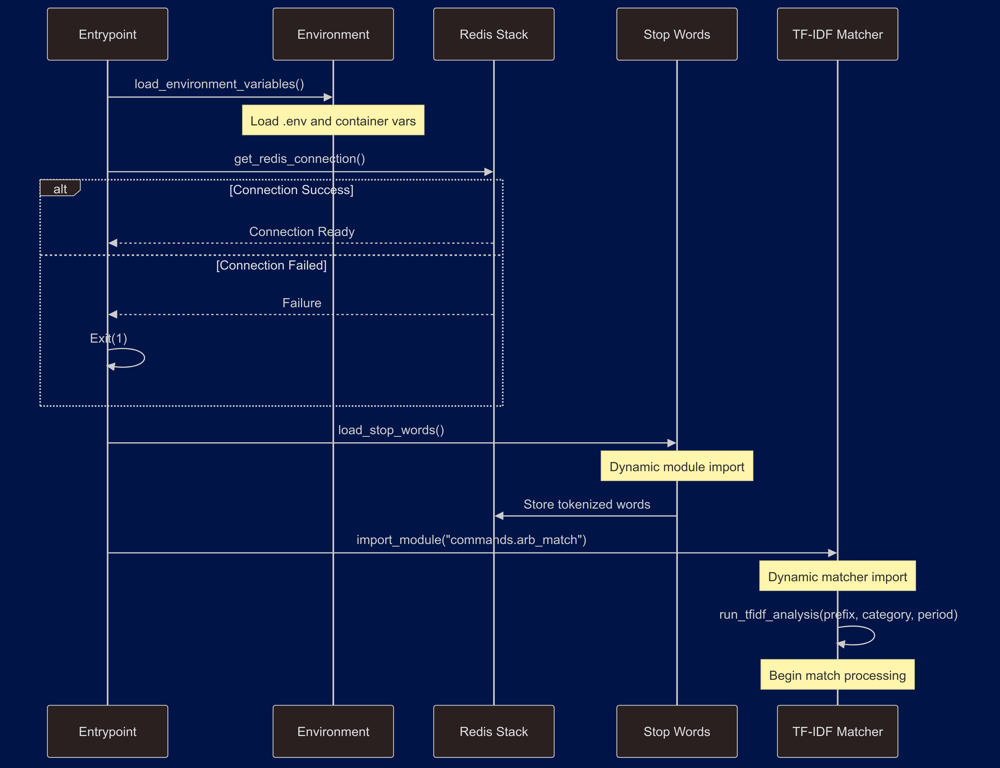

# TF-IDF Match Processing System - Entrypoint Documentation

---
linked:
  - 
---

## System Initialization Flow

### 1. Core Dependencies
```python
import sys
import os
from importlib import import_module
from utils.redis_helper import get_redis_connection
from utils.envLoader import load_environment_variables
```

Purpose:
- Dynamic module loading
- Environment configuration
- Redis connectivity
- System utilities

### 2. Environment Setup
```python
# Initial environment loading
load_environment_variables()  # Load from .env file

# Container-provided context
prefix = os.getenv("PREFIX")        # 'xtr' or 'lst'
category = os.getenv("CATEGORY")    # 'btts', 'three_way', 'double_chance'
period = os.getenv("PERIOD")        # 'live' or 'upcoming'
```

Configuration Sources:
- `.env` file
- Container environment
- Runtime parameters

## Stop Words Management

### 1. Loading Function
[[load_tokenized_stop-words]]
```python
def load_stop_words():
    """
    Loads and caches stop words in Redis.
    
    Process:
    1. Imports stop words module
    2. Processes and tokenizes words
    3. Stores in Redis for TF-IDF
    """
    try:
        stop_words_module = import_module("commands.load_stop_words")
        stop_words_module.load_stop_words_to_redis()
        print("Stop words loaded successfully.")
    except ImportError as e:
        print(f"Failed to import stop words module: {e}")
    except Exception as e:
        print(f"An error occurred while loading stop words: {e}")
```

### 2. Stop Words Processing Flow
```python
# From load_stop_words.py logs
Punkt tokenizer not found. Downloading...
Tokenized stop words loaded into Redis.
```

## Main Processing Initialization

### 1. Core Processing Function
```python
def import_and_run_analyze_match():
    """
    Initializes and runs the TF-IDF matching process.
    
    Flow:
    1. Ensures stop words are loaded
    2. Imports matching module
    3. Starts processing with container context
    """
    try:
        # Initialize dependencies
        load_stop_words()
        
        # Import matcher
        module = import_module("commands.arb_match")
        
        # Start processing
        module.run_tfidf_analysis(prefix, category, period)
```

### 2. Initialization Sequence
```python
if __name__ == "__main__":
    # Verify Redis connection
    redis_db = get_redis_connection()
    if not redis_db:
        print("Failed to connect to Redis.")
        sys.exit(1)

    # Start processing
    import_and_run_analyze_match()
```

## Error Handling Framework

### 1. Module Import Errors
```python
except ImportError as e:
    print(f"Failed to import module: {e}")
except AttributeError:
    print(f"Module does not have a run_extractor function.")
```

### 2. Processing Errors
```python
except Exception as e:
    print(f"An error occurred: {e}")
```

## Integration Points

### 1. Redis Connection
```python
# Connection validation
redis_db = get_redis_connection()
if not redis_db:
    print("Failed to connect to Redis.")
    sys.exit(1)
```

### 2. Module Dependencies
```python
# Dynamic imports
stop_words_module = import_module("commands.load_stop_words")
module = import_module("commands.arb_match")
```

## Processing Context

### 1. Stream Configuration
From processing logs:
```
Processing batch of 3 messages
Fetching data for 3 keys

Processing data key: BookieBeta_xtr-THREE_WAY_upcoming:1730561288-1
...Added 563 keys for data key
```

### 2. Resource Management
```python
# Loading sequence:
1. Environment variables
2. Redis connection
3. Stop words
4. Processing module
```

## Best Practices

### 1. Initialization
- Sequential dependency loading
- Connection verification
- Resource validation
- Error handling

### 2. Module Management
- Dynamic imports
- Error recovery
- Resource cleanup
- State tracking

### 3. Error Handling
- Specific error catching
- Graceful degradation
- Resource cleanup
- System stability

## Monitoring and Logging

### 1. Process State
From logs:
```
2024-11-02 15:28:26,456 - commands.arb_match - INFO - 
Processing batch of 3 messages

2024-11-02 15:28:26,456 - commands.arb_match - INFO - 
Fetching data for 3 keys
```

### 2. Error Tracking
```python
except Exception as e:
    print(f"An error occurred: {e}")
    # Log error details
    logger.error(f"Exception in processing: {str(e)}", exc_info=True)
```

## Production Considerations

### 1. Startup Management
- Dependency verification
- Resource availability
- Error recovery
- State initialization

### 2. Resource Management
- Memory usage
- Connection pools
- Cache utilization
- Clean shutdown

### 3. Monitoring
- Process health
- Error rates
- Resource usage
- System state

## Initialization Flow
```
Environment Loading
        ↓
Redis Connection
        ↓
Stop Words Loading
        ↓
Module Import
        ↓
Processing Start
```



## Usage Examples

### 1. Container Start
```bash
# Container provides context
PREFIX=xtr | lst CATEGORY=btts PERIOD=live python main.py
```

### 2. Process Monitoring
```bash
# View processing logs
tail -f /var/log/analyzeMatch/container_name_*.log
```

## Summary of Data Flow

