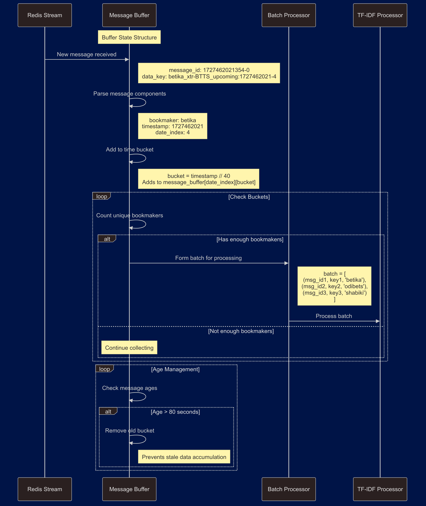

# Bookmaker Match'n Modules - Core Implementation Documentation

---
linked:
  - 
  - 
  - 
  - 
  - 
---

## Overview of the Problem Being Solved

Before diving into the code, it's crucial to understand what these correlation modules aim to achieve:

- Different bookmakers (Bookiealpha, Bookiebeta, etc.) list the same soccer matches
- Each bookmaker might write team names differently (e.g., "Man United" vs "Manchester United")
- Matches need to be matched across bookmakers for odds comparison
- Matches must be from the same time period to ensure they're the same event

## Module Architecture

### High-Level Flow

1. Message reception from Redis streams
2. Temporal data grouping and validation
3. TF-IDF vectorization and processing
4. Cross-bookmaker similarity matching
5. Match group formation
6. Redis state updates


The modules employ a somewhat sophisticated combination of TF-IDF processing, disjoint set operations (union-find), and temporal validation to ensure accurate match correlation across different bookmakers.

## Core Components Analysis

### 1. Main Entry Point (`arb_match.py`)

Its primary function is to ensure data freshness in the stream processing pipeline. Rather than focusing on matching simultaneous matches, its key objective is to process only the most recent entries from different bookmakers while preventing the accumulation of stale data.

### Message Buffer Lifecycle

## A. Message Lifecycle States

 ### **Ingestion Phase**

### Function Signature
```python
def run_tfidf_analysis(prefix: str, category: str, period: str) -> None:
    """
    Manages the continuous process of match data collection and batch processing.
    
    Args:
        prefix: str - System prefix (e.g., 'xtr' or 'lst')
        category: str - Match category ('btts', 'three_way', 'double_chance')
        period: str - Time period ('live' or 'upcoming')
    """
```

Step-by-step analysis:
1. **Stream Setup**
   ```python
   stream_name = f"{prefix}-{stream_config[category][period]}"
   stream_key = f"{period}_{category}-matched_stream"
   group_name = f"{period}_{category}-consumer_group"
   ```
   - Constructs stream identifiers based on input parameters
   - Creates unique consumer group names
   - Sets up output stream keys

	**function handles messages from a Redis stream, where each message contains a reference to JSON data stored by bookmaker extractors. These references follow a structured format and as will be observed below are used for grouping:**
	
```python
# Stream message example:
[['xtr-BTTS_upcoming_stream', [
    ('1727462021354-0', {'data_key': 'BookieAlpha_xtr-BTTS_upcoming:1727462021-4'})
]]]

# Reference components breakdown:
- bookmaker: 'BookieAlpha'                 # Source bookmaker
- prefix-type: 'xtr-BTTS'            # Stream identifier and bet type
- status: 'upcoming'                  # Match timing status
- timestamp: '1727462021'            # Entry creation time
- period: '4'                        # Future date index (0=today, 1=tomorrow, etc.)
```

2. **Message Buffer Management**
```python
Structure:
{
    date_index: {             # Day identifier (0=today, 1=tomorrow...)
        timestamp_bucket: [    # 40-second time window
            (message_id,      # Stream message identifier
             data_key,        # Redis data reference
             bookmaker)       # Source bookmaker
        ]
    }
}
```

3. **Message Processing**
   ```python
   message_id, message_data = messages[0][1][0]
   data_key = message_data.get("data_key")
   ```
   - Extracts message metadata
   - Parses bookmaker information
   - Groups by time divisions

4. **Time Window Organization**
```python
TIMESTAMP_DIVISOR = 40  # Creates 40-second time buckets
message_buffer = defaultdict(lambda: defaultdict(list))
```

Key aspects:
- Messages are grouped into 40-second time buckets using integer division
- This creates a rolling window of recent data
- Older buckets are automatically aged out
- Maintains data freshness without explicit timestamp comparisons

5. **Message Buffer Structure**
```python
# Parse the timestamp from the JSON key
parts = data_key.split(":")
bookmaker, timestamp_suffix = parts[0].split("_")[0], parts[1].split("-")
timestamp = int(timestamp_suffix[0])

# Group by time bucket
message_buffer[date_index][timestamp // TIMESTAMP_DIVISOR].append(
    (message_id, data_key, bookmaker)
)
```

The three-level structure serves specific purposes:
- First level (date_index): Separates data by target date (0=today, 1=tomorrow, etc.)
- Second level (timestamp bucket): Groups messages by recency
- Third level (message list): Collects messages from different bookmakers within the same time bucket
- Maintains relationship to original data

## B. Buffer Management

 ### **Buffer Management Phase**

### Function Signature
```python
def process_time_based_batches(
    redis_db: Redis,
    message_buffer: DefaultDict,
    stream_name: str,
    group_name: str,
    tokenized_stop_words: List[str],
    batch_stream_count: int,
    stream_key: str,
    current_timestamp: int,
    least_count: int
) -> None:
    """
    Forms and processes batches of messages from time-aligned matches.
    
    Args:
        redis_db: Redis connection
        message_buffer: Nested defaultdict containing message groups
        stream_name: Name of source stream
        group_name: Consumer group identifier
        tokenized_stop_words: List of words to ignore in matching
        batch_stream_count: Required number of unique bookmakers
        stream_key: Output stream identifier
        current_timestamp: Current processing time
        least_count: Minimum matches required for group formation
    """
```

### Processing Flow


#### 1. Buffer Cleanup Operations

```python
# First level cleanup - Date indices
for date_index, timestamp_data in list(message_buffer.items()):
    logger.info(f"Processing date index: {date_index}")
    
    # Second level cleanup - Timestamp groups
    for timestamp_group, messages in list(timestamp_data.items()):
        # Immediate removal of empty message lists
        if not messages:
            logger.info(f"Removing empty timestamp group: {timestamp_group}")
            del timestamp_data[timestamp_group]
            continue
```

Key operations:
- Iterates through date indices first (today, tomorrow, etc.)
- Removes empty timestamp groups immediately
- Uses list() for safe dictionary modification during iteration

#### 2. Batch Processing Triggers

1. **Primary Triggers**
   - Sufficient unique bookmakers present
   - Messages within same time bucket
   - Messages not expired

2. **Processing Conditions**
   ```python
   if len(batch) >= batch_stream_count:
       process_batch(
           redis_db,
           batch,
           stream_name,
           group_name,
           tokenized_stop_words,
           stream_key,
           least_count,
           logger,
       )
       # Remove processed messages
       timestamp_data[timestamp_group] = [
           m for m in messages if m[0] not in [b[0] for b in batch]
       ]
   ```

#### 3. Message Age Management

```python
# Get timestamp from most recent message in group
latest_message_time = max(
    int(msg[1].split(":")[1].split("-")[0]) for msg in messages
)
group_age = current_timestamp - latest_message_time

if group_age > 80:  # Remove groups older than 80 seconds
    logger.info(
        f"Removing old timestamp group: {timestamp_group}, age: {group_age} seconds"
    )
    del timestamp_data[timestamp_group]
```

Age control features:
- Tracks message group age
- Implements 80-second age limit
- Removes expired message groups

#### 4. Final Buffer State Management

```python
# Remove empty timestamp groups after processing
timestamp_data = {k: v for k, v in timestamp_data.items() if v}
if not timestamp_data:
    logger.info(f"Removing empty date index: {date_index}")
    del message_buffer[date_index]

# Stream maintenance
trim_stream(redis_db, stream_name, 100)
```

State maintenance operations:
- Cleans up empty timestamp groups
- Removes empty date indices
- Trims Redis stream size

	```markdown
	*buffer management components act s crucial pre-processors before the actual match correlation begins, ensuring that only valid, fresh, and properly grouped data proceeds to the next stage of processing.*
	```

```python

### Message Flow Example

To illustrate the buffer management process, consider this sequence:

1. Initial message arrival:

# Incoming message
{
    'data_key': 'BookieAlpha_xtr-BTTS_upcoming:1727462021-4',
    'message_id': '1727462021354-0',
    'bookmaker': 'BookieAlpha'
}

# Placed in buffer
message_buffer['4'][1727462021 // 40].append(
    (message_id, data_key, bookmaker)
)

2. Additional messages arrive and group formation begins:

# Time bucket content example
{
    '4': {                        # Date index (4 days ahead)
        43186550: [              # Timestamp bucket
            (msg_id1, key1, 'BookieAlpha'),
            (msg_id2, key2, 'BookieGamma'),
            (msg_id3, key3, 'BookieBeta')
        ]
    }
}

3. Age-based cleanup:

# Regular cleanup checks
current_time = int(time.time())
for timestamp_group, messages in timestamp_data.items():
    group_age = current_time - (timestamp_group * 40)
    if group_age > 80:
        del timestamp_data[timestamp_group]
```

## Summary of Data Flow



## Graph view

