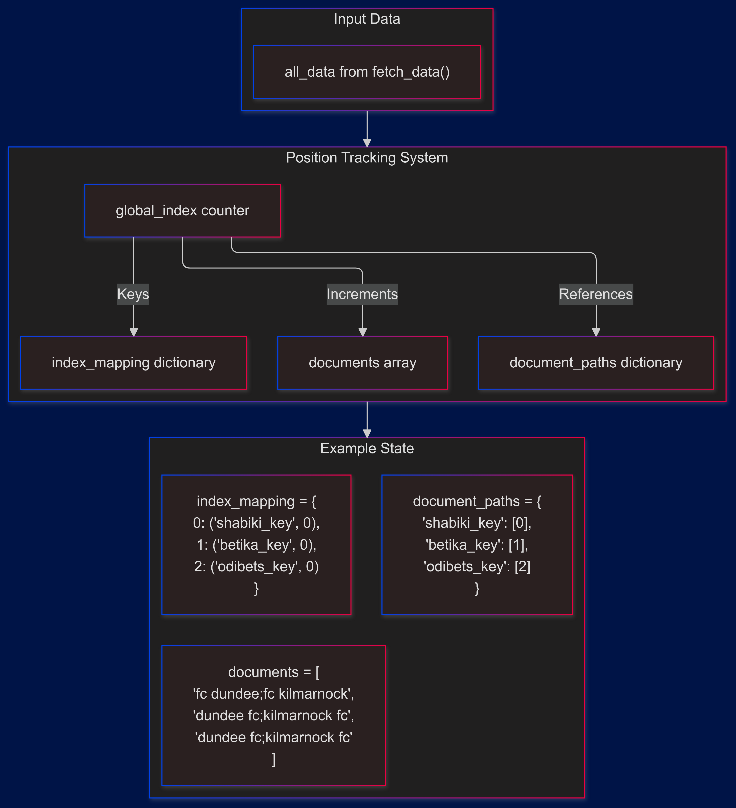

### 1. Post-Buffer Processing Flow

---
linked:
  - 
---

After messages are organized in the time-based buffer, the next component, critical to the processing flow, are the supporting fxns as follows:

### Function Signature

```python
def process_batch(redis_db, batch, stream_name, group_name, tokenized_stop_words, 
                 stream_key, least_count, logger):
    # Fetch full match data from Redis
    json_event_stream = fetch_data(
        redis_db, 
        logger, 
        [(msg_id, data_key) for msg_id, data_key, _ in batch]
    )

    # Prepare document structure
    documents = []              # Will hold team names
    document_paths = {}         # Maps to Redis locations
    index_mapping = {}         # Connects TF-IDF indices to data
    global_index = 0
```

The processing flow handles these key transformations:
1. Converts buffered message references into full match data
2. Extracts team names for comparison
3. Maintains mappings to original data locations



### 2. Data Retrieval Phase
The `fetch_data` operation transforms buffered message references into organized match data structures.

#### 2.1 Input Processing
```python
# Input batch format from process_batch:
[(msg_id, data_key, _) for msg_id, data_key, _ in batch]
# Example:
[
    ('1727462021354-0', 'BookieBeta_xtr-THREE_WAY_upcoming:1730561288-1'),
    ('1727462021355-0', 'BookieAlpha_xtr-THREE_WAY_upcoming:1730561305-1'),
    ('1727462021356-0', 'BookieGamma_xtr-THREE_WAY_upcoming:1730561300-1')
]
```

#### 2.2 Redis Data Retrieval
For each message reference, the function:
1. Extracts team data using JSON path pattern
```python
team_keys = redis_db.json().objkeys(data_key, Path("$.*.teams"))
```

2. Redis Data Structure:
```json
{
    "teams": {
        "PSM Makassar;Persik Kediri": {
            "1": { "odd_value": "2.32", ... },
            "X": { "odd_value": "3.55", ... },
            "2": { "odd_value": "2.80", ... }
        }
    }
}
```

#### 2.3 Team Key Extraction
The `.objkeys()` operation returns only the team name combinations from each bookmaker's data:

```python
# Redis objkeys operation
team_keys = redis_db.json().objkeys(data_key, Path("$.*.teams"))
# Returns just the team name keys, e.g.:
# ["Dundee FC;Kilmarnock FC"]  # From Bookiealpha
# ["FC Dundee;FC Kilmarnock"]  # From Bookiebeta
```

#### 2.4 Key Processing
Each team name key is processed and tracked:
```python
all_keys = [(str(key).lower(), index) for index, key in enumerate(team_keys)]
# Creates tuples of:
# [('dundee fc;kilmarnock fc', 0)]    # Standardized case with position
```

#### 2.5 Data Organization
```python
if all_keys:  # Only store if team keys found
    all_data[data_key] = all_keys
    logger.info(f"Added {len(all_keys)} keys for data key: {data_key}")
```

From logs:
```
Processing data key: BookieBeta_xtr-THREE_WAY_upcoming:1730561288-1
...Added 563 keys for data key

Processing data key: BookieAlpha_xtr-THREE_WAY_upcoming:1730561305-1
...Added 693 keys for data key

Processing data key: BookieGamma_xtr-THREE_WAY_upcoming:1730561300-1
...Added 664 keys for data key
```

#### 2.6 Document Preparation Flow
The retrieved team keys are organized into structures for TF-IDF processing:

```python
# Input from fetch_data:
all_data = {
    'BookieBeta_xtr-THREE_WAY_upcoming:1730561288-1': [
        ('fc dundee;fc kilmarnock', 0),
        # ... total of 563 team keys
    ],
    'BookieAlpha_xtr-THREE_WAY_upcoming:1730561305-1': [
        ('dundee fc;kilmarnock fc', 0),
        # ... total of 693 team keys
    ],
    'BookieGamma_xtr-THREE_WAY_upcoming:1730561300-1': [
        ('dundee fc;kilmarnock fc', 0),
        # ... total of 664 team keys
    ]
}
```