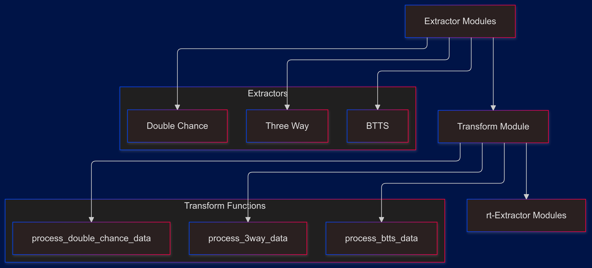
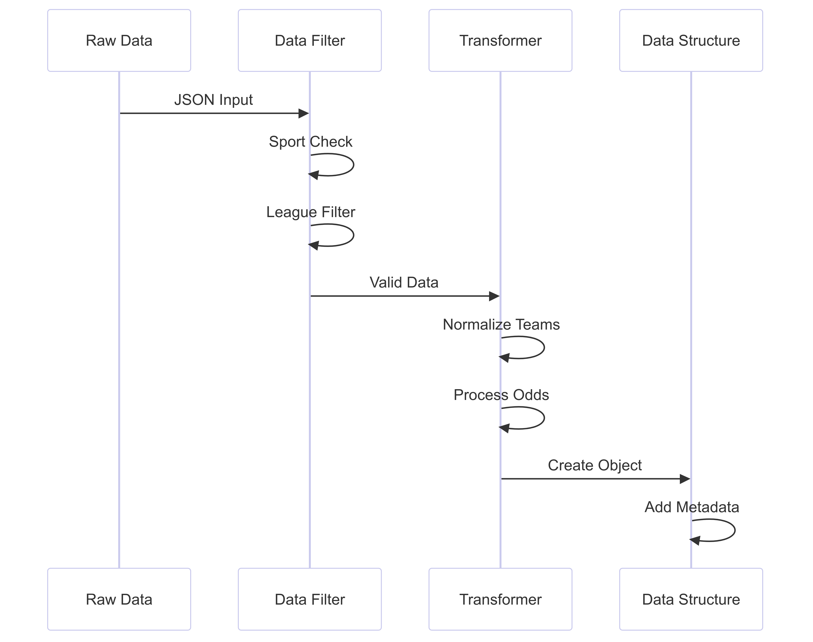

# Bookiealpha Data Pipeline Analysis


## Core Components Interaction



## Data Transformation Functions

### 1. Three-Way Processing
```python
def process_3way_data(three_way_json):
    allData = three_way_json.get("data", [])
    list_3way = []
    
    for data in allData:
        # Sport validation
        if data.get("sport_name") != "Soccer":
            continue
        
        # Virtual game filtering
        if "Simulated Reality League" in data.get("category"):
            continue
            
        if "SRL" in data.get("competition_name").upper():
            continue
```

#### Key Features:
- Filters non-soccer events
- Excludes virtual/simulated games
- Processes 1X2 markets

### 2. BTTS Processing
```python
def process_btts_data(btts_json):
    list_btts = []
    # Similar filtering logic
    for data in allData2:
        dict_btts = {
            "bookmaker": "BookieAlpha",
            "start_time": start_time,
            "competition_name": competition,
            "teams": {},
            "parent_match_id": int(parent_match_id),
            # ... additional fields
        }
```

### 3. Double Chance Processing
```python
def process_double_chance_data(double_chance_json):
    position_map = {
        "1/X": "1X",
        "1/2": "12",
        "X/2": "X2"
    }
    # Processing with position mapping
```

## Data Structure Standards

### 1. Common Match Object Structure
```python
{
    "bookmaker": "BookieAlpha",
    "start_time": start_time,
    "competition_name": competition,
    "teams": {},
    "parent_match_id": int(parent_match_id),
    "sport_id": sport_id,
    "sub_type_id": sub_type_id,
    "bet_type": "",
    "betradar_timestamp": betStamp,
    "current_timestamp": current_time,
    "create_date": get_current_date(),
    "target_date": ""
}
```

### 2. Odds Structure
```python
{
    "odd_": outcome["odd_value"],
    "odd_s_active": outcome.get("odd_active", ""),
    "outcome_id": outcome["outcome_id"],
    "split(%)": "",
    "currency": ""
}
```

## Market Type Processing

### 1. Three-Way Markets
```python
dict_outcome[outcome["display"]] = {
    "odd_": outcome["odd_value"],
    "odd_s_active": outcome.get("odd_active", ""),
    "outcome_id": outcome["outcome_id"],
    "split(%)": "",
    "currency": "",
}
```

### 2. BTTS Markets
```python
dict_btts[outcome["odd_key"]] = {
    "odd_": outcome["odd_value"],
    "odd_s_active": outcome.get("odd_active", ""),
    "outcome_id": outcome["outcome_id"],
    "split(%)": "",
    "currency": "",
}
```

### 3. Double Chance Markets
```python
dict_double_chance[position_map.get(outcome["display"])] = {
    "odd_": outcome["odd_value"],
    "odd_s_active": outcome.get("odd_active", ""),
    "outcome_id": outcome["outcome_id"],
    "split(%)": "",
    "currency": "",
}
```

## Data Validation and Cleaning

### 1. Team Name Normalization
```python
team1 = normalize_string(data["home_team"])
team2 = normalize_string(data["away_team"])
```

### 2. Competition Formatting
```python
competition_name: str = data["competition_name"]
category: str = data["category"]
competition = f"{competition_name.lower()}_{category.lower()}"
```

## Teams Object Structure
```python
dict_outcome["teams"][f"{team1};{team2}"] = {
    outcome["display"]: {
        "odd_value": outcome["odd_value"],
        "odd_active": outcome.get("odd_active", ""),
        "odd_key|outcome": outcome.get("odd_key", ""),
    }
    for outcome in all_outcomes
}
```

## Processing Flow



## Error Handling and Validation

### 1. Data Presence Checks
```python
allData = three_way_json.get("data", [])
if not allData:  # Early exit if no data
    return []
```

### 2. Sport Validation
```python
if data.get("sport_name") != "Soccer":
    continue
```

### 3. Virtual Game Filtering
```python
if "Simulated Reality League" in data.get("category"):
    continue
if "SRL" in data.get("competition_name").upper():
    continue
```

## Unique Bookiealpha Features

### 1. Timestamp Handling
```python
betStamp = data.get("betradar_timestamp", "")
current_time = data.get("current_timestamp", "")
```

### 2. SubType ID Management
```python
sub_type_id = present.get("sub_type_id", "")
```

### 3. Outcome Display Mapping
```python
# For Double Chance
position_map = {
    "1/X": "1X",
    "1/2": "12",
    "X/2": "X2"
}
```

## Performance Optimizations

### 1. Early Returns
- Empty data checks
- Sport type validation
- League filtering

### 2. Efficient Data Structure Creation
- Single pass processing
- Dictionary comprehensions
- Minimal data copying

### 3. Memory Management
- List pre-allocation
- Dictionary defaulting
- Efficient string operations

## Best Practices

### 1. Data Consistency
```python
# Consistent team name formatting
team1 = normalize_string(data["home_team"])
team2 = normalize_string(data["away_team"])

# Consistent competition naming
competition = f"{competition_name.lower()}_{category.lower()}"
```

### 2. Type Safety
```python
parent_match_id = int(parent_match_id)
sport_id = data["sport_id"]
```

### 3. Default Values
```python
outcome.get("odd_active", "")
present.get("sub_type_id", "")
```

## Comparison with Bookiegamma

### Similar Features
1. Team name normalization
2. Sport type filtering
3. Basic data structure

### Unique Features
1. Betradar timestamp handling
2. Different position mapping
3. SubType ID management

### Processing Differences
1. Odds structure variations
2. Different market naming
3. Timestamp handling

## Integration Points

### 1. With Extractors
```python
processed_data = process_3way_data(response_data)
processed_data = process_btts_data(response_data)
processed_data = process_double_chance_data(response_data)
```

### 2. With Redis
```python
# Storage pattern
redis_conn.json().set(json_key, Path.root_path(), processed_data)
```