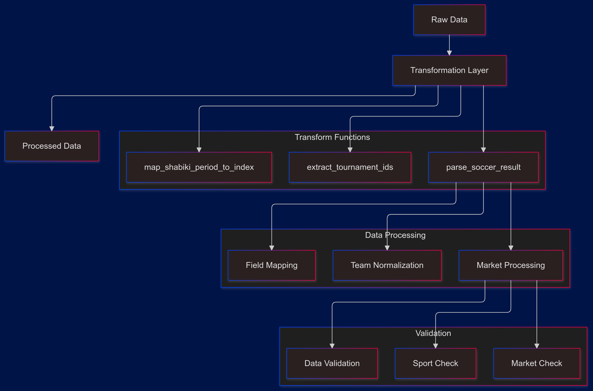
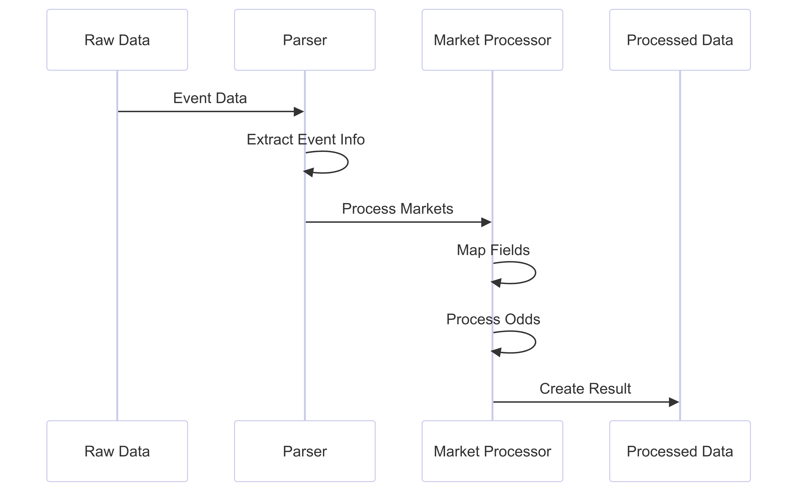

# Bookiebeta Data Pipeline Analysis


## Core Components Interaction



## Core Transformation Functions

### 1. Soccer Result Parsing
```python
def parse_soccer_result(data: Dict[str, Any], odd_type: str) -> List[Dict[str, Any]]:
    position_map = {
        "W1": "1",
        "Draw": "X",
        "W2": "2",
        "Yes": "yes",
        "No": "no",
    }
    
    result = []
    contents = data.get("Contents", {})
    events = contents.get("Events", [])
```

#### Key Features:
- Position standardization
- Event data extraction
- Market type handling

### 2. Market Data Structure
```python
match_data = {
    "bookmaker": "BookieBeta",
    "start_time": start_time,
    "competition_name": f"{tournament_name}_{category_name}",
    "match_id": match_id,
    "teams": {
        f"{normalize_string(home_team)};{normalize_string(away_team)}": {}
    },
    "away_team_id": away_team_id,
    "home_team_id": home_team_id,
    "created_date": get_current_date(),
    "target_date": target_date,
}
```

## Market Processing Flow



## Market Type Implementation

### 1. Market Detection
```python
target_market = next(
    (market for market in markets
     if market.get("MarketName", {}).get("langValues", {}).get("en")
     == odd_type),
    None
)

if not target_market:
    continue
```

### 2. Field Processing
```python
for field in market_fields:
    field_name = field.get("FieldName", {}).get("International")
    field_display = position_map.get(field_name, field_name)
    field_data = {
        "odd_": str(field.get("Value")),
        "display": field_name,
        "odd_s_active": field.get("Active"),
        "type_id": field.get("FieldTypeId"),
        "normal_odd": field.get("Extra", {}).get("NormalValue"),
        "deboost": field.get("Extra", {}).get("Deboost"),
    }
```

## Tournament ID Processing

### 1. Extraction Function
```python
def extract_tournament_ids(data, filter="24H"):
    result = []
    period = filter if filter == "24H" else "All"
    
    football_sport = next(
        (sport for sport in data.get("Sports", [])
         if sport.get("Name", {}).get("International") == "Football"),
        None
    )
```

### 2. Tournament Data Structure
```python
tournament_data = {
    "ProviderId": sport_id,
    "tournId": f"{sport_id},{category_id},{tournament_id}",
    "filter": period,
    "groupName": None,
    "subGroupName": None,
}
```

## Period Handling

### Period Mapping Implementation
```python
def map_BookieBeta_period_to_index(period):
    filters = ["24H", "2D", "3D", "4D", "5D"]
    try:
        return filters.index(period)
    except ValueError:
        return 0
```

## Data Validation and Processing

### 1. Market Validation
```python
# Required odds validation
if odd_type == "Match Result":
    required_odds = {"1", "X", "2"}
elif odd_type == "Both Teams To Score":
    required_odds = {"yes", "no"}
elif odd_type == "Double Chance":
    required_odds = {"1X", "12", "X2"}
```

### 2. Team Information Processing
```python
team_key = next(iter(match_data["teams"]))
match_data[field_display] = field_data
match_data["teams"][team_key][field_display] = field_data
```

## Error Handling

### 1. Data Access Safety
```python
tournament_name = info.get("TournamentName", {}).get("International")
category_name = info.get("CategoryName", {}).get("International")
```

### 2. Type Safety
```python
match_id = event.get("MatchId")
away_team_id = info.get("AwayTeamId")
home_team_id = info.get("HomeTeamId")
```

## Unique Bookiebeta Features

### 1. International Name Handling
```python
away_team = info.get("AwayTeamName", {}).get("International")
home_team = info.get("HomeTeamName", {}).get("International")
```

### 2. Market Field Structure
```python
field_data = {
    "odd_": str(field.get("Value")),
    "display": field_name,
    "odd_s_active": field.get("Active"),
    "type_id": field.get("FieldTypeId"),
    "normal_odd": field.get("Extra", {}).get("NormalValue"),
    "deboost": field.get("Extra", {}).get("Deboost"),
}
```

## Performance Optimizations

### 1. Efficient Data Access
- Uses dictionary .get() method with defaults
- Implements generator expressions
- Utilizes next() for single item retrieval

### 2. Data Structure Efficiency
- Pre-allocation of result lists
- Single-pass data processing
- Minimal data copying

## Comparison with Other Bookmakers

### Similarities with Bookiealpha/Bookiegamma
1. Team name normalization
2. Market type handling
3. Odds structure

### Unique Features
1. International name handling
2. Deboost field
3. Tournament ID structure

## Integration Examples

### 1. Processing Match Result
```python
processed_data = parse_soccer_result(raw_data, "Match Result")
```

### 2. Processing BTTS
```python
processed_data = parse_soccer_result(raw_data, "Both Teams To Score")
```

### 3. Processing Double Chance
```python
processed_data = parse_soccer_result(raw_data, "Double Chance")
```

## Best Practices

### 1. Data Consistency
- Standardized field naming
- Consistent type handling
- Unified market structure

### 2. Code Organization
- Modular functions
- Clear responsibility separation
- Reusable components

### 3. Error Prevention
- Comprehensive validation
- Safe data access
- Type checking

### 4. Performance
- Efficient algorithms
- Memory management
- Optimized data structures