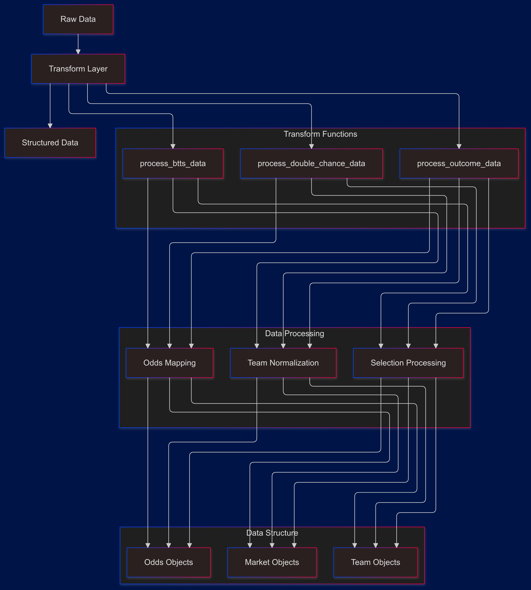

# SportPesa Data Transform Analysis


## Core Components Interaction



## Core Transformation Functions

### 1. Three-Way (Match Result) Processing
```python
def process_outcome_data(grouped_data):
    list_3way = []
    position_map = {0: "1", 1: "X", 2: "2"}
    for eventId, event_data in grouped_data.items():
        three_way_data = event_data.get("Match Result", event_data.get("3 Way", []))
        for data in three_way_data:
            dict_outcome = {
                "bookmaker": "BookieDelta",
                "start_time": "",
                "competition_name": "",
                "teams": {},
                "event_status": data.get("status", ""),
                "eventId_gameId": int(eventId),
                "market_id": data.get("id", ""),
                "create_date": get_current_date(),
                "target_date": "",
            }
```

### 2. Double Chance Processing
```python
def process_double_chance_data(grouped_data):
    list_double_chance = []
    position_map = {
        "1 or X": "1X",
        "1 or 2": "12", 
        "X or 2": "X2"
    }
    
    for eventId, event_data in grouped_data.items():
        match_results = event_data.get("Match Result", event_data.get("3 Way", []))
        double_chance = event_data.get("Double Chance", [])
```

### 3. BTTS Processing
```python
def process_btts_data(grouped_data):
    list_btts = []
    for eventId, event_data in grouped_data.items():
        try:
            btts = event_data.get("Both Teams To Score", [])
            match_results = event_data.get("Match Result", event_data.get("3 Way", []))
            for data1, data2 in zip(match_results, btts):
                dict_btts = {
                    "bookmaker": "BookieDelta",
                    "start_time": "",
                    "competition_name": "",
                    "teams": {},
                    "event_status": data2.get("status", ""),
                    "eventId_gameId": int(eventId),
                    "market_id": data2.get("id", ""),
                    "create_date": get_current_date(),
                    "target_date": "",
                }
```

## Data Structure Standards

### 1. Selection Processing
```python
for selection in selections:
    shortName_key = selection.get("shortName", position_map.get(index))
    dict_outcome[shortName_key] = {
        "odd_": selection["odds"],
        "selection_id": selection.get("id"),
        "odds_status": selection.get("status"),
        "split(%)": "",
        "currency": "",
    }
```

### 2. Team Structure
```python
key = ";".join(normalize_string(s["name"]) for s in selections[::2])
dict_outcome["teams"][key] = {
    select.get("shortName", position_map.get(select.get("pos"))): {
        "odd_value": select["odds"],
        "odd_status": select.get("status", ""),
        "outcome": select.get("name", ""),
    }
    for select in selections
}
```

## Market Type Features

### 1. Position Mapping
```python
# Three-Way Mapping
position_map = {0: "1", 1: "X", 2: "2"}

# Double Chance Mapping
position_map = {
    "1 or X": "1X",
    "1 or 2": "12",
    "X or 2": "X2"
}
```

### 2. Market Identification
```python
three_way_data = event_data.get("Match Result", event_data.get("3 Way", []))
btts = event_data.get("Both Teams To Score", [])
double_chance = event_data.get("Double Chance", [])
```

## Data Processing Flow

![[BookieDelta_gen_seqFlow.png]]

## Error Handling and Validation

### 1. Safe Data Access
```python
betStatus = data.get("status", "")
marketID = data.get("id", "")
selections = data.get("selections", [])
```

### 2. Type Safety
```python
eventId_gameId = int(eventId)
odd_value = selection["odds"]
selection_id = selection.get("id")
```

### 3. Exception Handling
```python
try:
    btts = event_data.get("Both Teams To Score", [])
    match_results = event_data.get("Match Result", [])
    # Process data
except KeyError:
    pass
```

## Unique SportPesa Features

### 1. Selection Processing
- Index-based position mapping
- Short name handling
- Status tracking

### 2. Market Structure
- Parallel market processing
- Market ID tracking
- Event status management

### 3. Data Organization
- Event-based grouping
- Selection-based structure
- Market-specific processing

## Performance Optimizations

### 1. Data Processing
- Efficient iteration
- List preallocation
- Dictionary comprehensions

### 2. Memory Management
- Minimal data copying
- Efficient string operations
- Reusable structures

## Comparison with Other Bookmakers

### Similar Features
1. Team name normalization
2. Market type handling
3. Odds structure

### Unique Aspects
1. Selection-based processing
2. Position mapping approach
3. Market correlation (match results with other markets)

## Integration Examples

### 1. Three-Way Processing
```python
processed_data = process_outcome_data(grouped_match_data)
```

### 2. BTTS Processing
```python
processed_data = process_btts_data(grouped_match_data)
```

### 3. Double Chance Processing
```python
processed_data = process_double_chance_data(grouped_match_data)
```

## Best Practices

### 1. Data Consistency
- Standardized field names
- Consistent type handling
- Uniform market structure

### 2. Code Organization
- Modular functions
- Clear responsibility separation
- Reusable components

### 3. Error Prevention
- Defensive programming
- Type checking
- Safe data access

### 4. Optimization
- Efficient algorithms
- Memory management
- Performance consideration