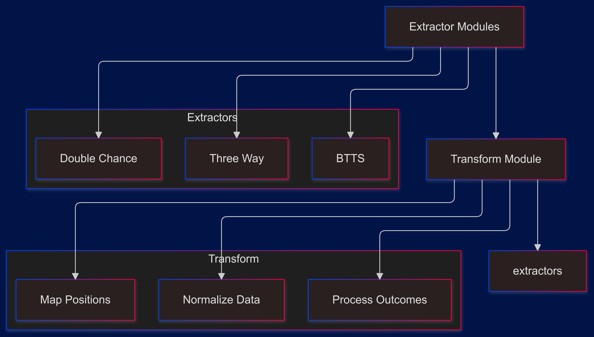
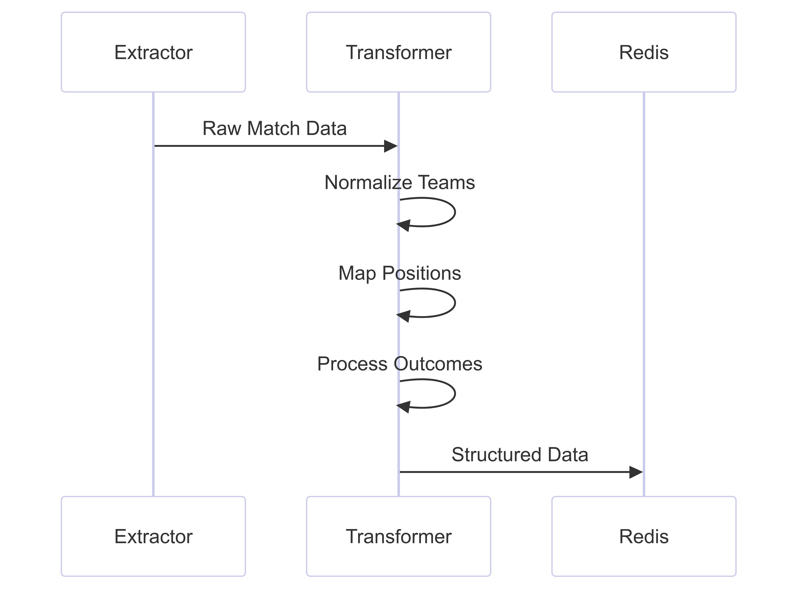

# Bookiegamma Data Pipeline Analysis


## Core Components Interaction



## Data Transformation Process

### 1. Outcome Processing
```python
def process_outcome_data(outcome_data, odd_type):
    processed_outcomes = []
    position_map = {
        "1 or X": "1X",
        "1 or 2": "12",
        "X or 2": "X2",
        "Yes": "yes",
        "No": "no",
    }
```

#### Key Features:
- Standardizes position naming
- Handles multiple bet types
- Maintains data consistency

### 2. Data Structure Transformation

```python
dict_outcome = {
    "bookmaker": "BookieGamma",
    "start_time": start_time,
    "competition_name": competition,
    "teams": {},
    "parent_match_id": int(parent_match_id),
    "create_date": get_current_date(),
    "target_date": "",
}
```

#### Transformed Data Fields:
- Match metadata (times, IDs)
- Team information
- Odds data
- Market status

## Extraction and Transformation Flow

### 1. Initial Data Reception



### 2. Outcome Processing Details
```python
for outcome in all_outcomes:
    outcome_key = position_map.get(
        outcome["outcome_key"], 
        outcome["outcome_key"]
    )
    dict_outcome[outcome_key] = {
        "odd_": outcome["odd_value"],
        "live": outcome.get("live", ""),
        "odd_status": outcome.get("status", ""),
        "event_status": outcome.get("active", ""),
        "split(%)": "",
        "currency": "",
    }
```

## Market Type Processing

### 1. Three-Way Markets
- Processes Win/Draw/Loss outcomes
- Maps 1, X, 2 positions
- Handles match result markets

### 2. BTTS Markets
- Processes Yes/No outcomes
- Maps to standardized format
- Handles goal scoring markets

### 3. Double Chance Markets
- Processes combined outcomes
- Maps 1X, 12, X2 positions
- Handles multiple result markets

## Data Validation and Cleaning

### 1. Team Name Normalization
```python
team1 = normalize_string(matches["home_team"])
team2 = normalize_string(matches["away_team"])
```
- Removes special characters
- Standardizes team names
- Ensures consistency

### 2. Competition Processing
```python
competition_name: str = matches.get("competition_name", "")
category: str = matches.get("category_name", "")
competition = f"{competition_name.lower()}_{category.lower()}"
```
- Combines competition and category
- Standardizes naming
- Maintains hierarchy

## Market Structure

### 1. Outcome Structure
```python
{
    "odd_value": outcome["odd_value"],
    "prev_oddValue": outcome.get("prev_odd_value", ""),
    "outcome": outcome.get("outcome_name", ""),
}
```

### 2. Team Structure
```python
dict_outcome["teams"][f"{team1};{team2}"] = {
    position_map.get(outcome["outcome_key"], outcome["outcome_key"]): {
        "odd_value": outcome["odd_value"],
        "prev_oddValue": outcome.get("prev_odd_value", ""),
        "outcome": outcome.get("outcome_name", ""),
    }
    for outcome in all_outcomes
}
```

## Integration Points

### 1. Extractor Integration
```python
processed_data = process_outcome_data(data, odd_type)
```
- Called from extraction modules
- Handles different bet types
- Returns standardized format

### 2. Redis Integration
```python
redis_conn.json().merge(
    d_key, 
    "$.match_team_objects.BookieGamma", 
    processed_data
)
```
- Stores transformed data
- Updates existing entries
- Maintains data structure

## Error Handling and Validation

### 1. Data Validation
```python
if matches.get("sport_name") != "Soccer":
    continue
```
- Sport type validation
- Required field checking
- Data type verification

### 2. Null Handling
```python
outcome.get("prev_odd_value", "")
outcome.get("status", "")
```
- Safe dictionary access
- Default value handling
- Missing data management

## Performance Considerations

### 1. Data Processing
- Minimal data copying
- Efficient dictionary operations
- Optimized loops

### 2. Memory Management
- Stream processing
- No unnecessary storage
- Clean data structures

## Usage Examples

### Processing Three-Way Markets
```python
data = process_outcome_data(match_data, "1X2")
```

### Processing BTTS Markets
```python
data = process_outcome_data(match_data, "GG/NG")
```

### Processing Double Chance Markets
```python
data = process_outcome_data(match_data, "Double chance")
```

## Best Practices Implemented

1. **Data Consistency**
   - Standardized naming
   - Consistent structure
   - Type safety

2. **Error Prevention**
   - Defensive programming
   - Safe access patterns
   - Validation checks

3. **Code Organization**
   - Clear function scope
   - Modular design
   - Reusable components

4. **Performance**
   - Efficient processing
   - Minimal iterations
   - Optimized transformations