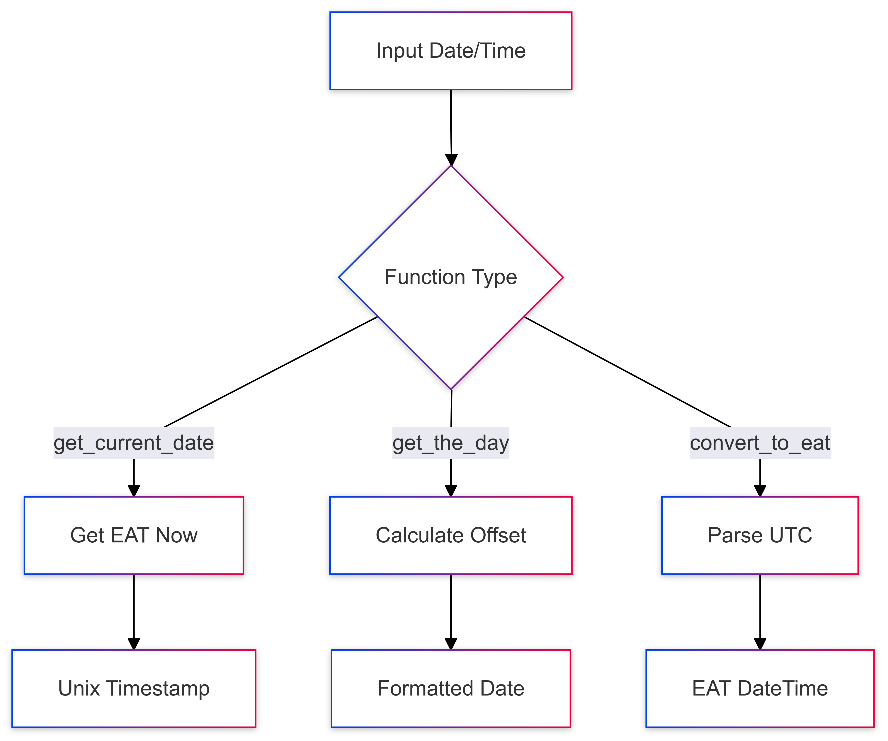
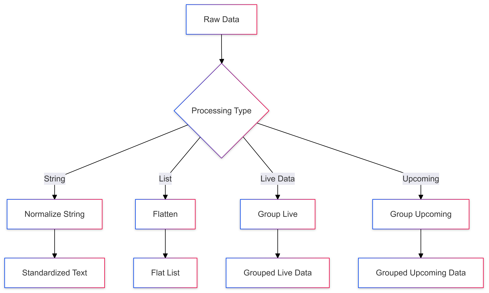

# Common Utilities Analysis

used by: 
  - ,,,

## Time Management Functions

### 1. get_current_date()
```python
def get_current_date():
    eat_tz = pytz.timezone('Africa/Nairobi')
    now = datetime.now(eat_tz)
    return int(now.timestamp())
```

**Purpose**: Provides current timestamp in East African Time (EAT)
- Uses pytz for reliable timezone handling
- Returns Unix timestamp (integer)
- Standardizes time across application

### 2. get_the_day(days_offset=0)
```python
def get_the_day(days_offset=0):
    tz = pytz.timezone('Africa/Nairobi')
    today_eat = datetime.now(tz)
    target_date = today_eat + timedelta(days=days_offset)
    formatted_date = target_date.strftime('%Y-%m-%d')
    return formatted_date
```

**Purpose**: Calculates dates relative to today in EAT
- Accepts offset in days (can be negative or positive)
- Returns formatted date string (YYYY-MM-DD)
- Used for match scheduling and filtering

### 3. convert_to_eat(date_str)
```python
def convert_to_eat(date_str):
    dt = datetime.strptime(date_str, "%Y-%m-%dT%H:%M:%S")
    utc_tz = pytz.UTC
    dt_utc = utc_tz.localize(dt)
    return dt_utc
```

**Purpose**: Converts UTC string to EAT datetime
- Parses ISO format datetime strings
- Handles timezone conversion
- Returns timezone-aware datetime object

## Data Processing Functions

### 1. normalize_string(s)
```python
def normalize_string(s):
    normalized = unicodedata.normalize("NFKD", s)
                          .encode("ascii", "ignore")
                          .decode("utf-8")
    return normalized.replace("?", "")
```

**Purpose**: Standardizes text data
- Removes diacritics and special characters
- Handles Unicode normalization
- Ensures consistent team name formatting

### 2. flatten(lst)
```python
def flatten(lst):
    flattened = []
    for item in lst:
        if isinstance(item, list):
            flattened.extend(flatten(item))
        else:
            flattened.append(item)
    return flattened
```

**Purpose**: Recursively flattens nested lists
- Handles arbitrary nesting depth
- Maintains order of elements
- Returns single-level list

## SportPesa Data Processing

### 1. group_json_data_live(data)
```python
def group_json_data_live(data):
    grouped_data = defaultdict(lambda: defaultdict(list))
    
    def process_item(item):
        eventId = item.get("eventId")
        name = item.get("name")
        
        if eventId and name in ["Match Result", 
                              "Double Chance", 
                              "Both Teams To Score"]:
            grouped_data[eventId][name].append(item)

    with concurrent.futures.ThreadPoolExecutor() as executor:
        items = data.get("markets", [])
        executor.map(process_item, items)

    return {"grouped_data": dict(grouped_data)}
```

**Purpose**: Processes live betting data
- Groups by event ID and bet type
- Uses concurrent processing for performance
- Filters relevant betting markets

### 2. group_json_data_upcoming(data)
```python
def group_json_data_upcoming(data):
    valid_market_names = ["3 Way", "Double Chance", 
                         "Both Teams To Score"]
    grouped_data = defaultdict(lambda: defaultdict(list))

    def process_market(game_id, market):
        market_name = market["name"]
        if market_name in valid_market_names:
            grouped_data[game_id][market_name].append(market)

    with concurrent.futures.ThreadPoolExecutor() as executor:
        tasks = [
            executor.submit(process_market, game_id, market)
            for game_id, markets in data.items()
            for market in markets
        ]
        concurrent.futures.wait(tasks)

    return {"grouped_data": dict(grouped_data)}
```

**Purpose**: Processes upcoming match data
- Groups by game ID and market type
- Implements concurrent processing
- Filters specific market types

## Data Flow Diagrams

### Time Management Flow


### Data Processing Flow


## Implementation Best Practices

### 1. Time Management
- Consistent use of EAT timezone
- Proper handling of timezone conversions
- Error-safe date parsing and formatting

### 2. Data Processing
- Thread pooling for performance
- Defensive programming with `.get()`
- Clear separation of concerns

### 3. Code Structure
- Pure functions for predictability
- Clear function signatures
- Comprehensive error handling

## Usage Examples

### Time Functions
```python
# Get current timestamp
current_ts = get_current_date()

# Get tomorrow's date
tomorrow = get_the_day(1)

# Convert UTC string
eat_time = convert_to_eat("2024-01-01T12:00:00")
```

### Data Processing
```python
# Normalize team names
clean_name = normalize_string("München United")

# Flatten nested list
flat_list = flatten([[1, 2], [3, [4, 5]]])

# Process live data
grouped = group_json_data_live(market_data)
```

## Common Patterns and Considerations

### 1. Performance Optimization
- Concurrent processing for large datasets
- Efficient data structure usage
- Minimal memory footprint

### 2. Error Prevention
- Type checking where necessary
- Defensive dictionary access
- Safe string operations

### 3. Maintainability
- Consistent function naming
- Clear documentation
- Modular design

This utility module serves as a foundation for the entire application, providing essential functions for:
- Time and date management
- Data normalization and processing
- Concurrent operations
- Standardized data grouping